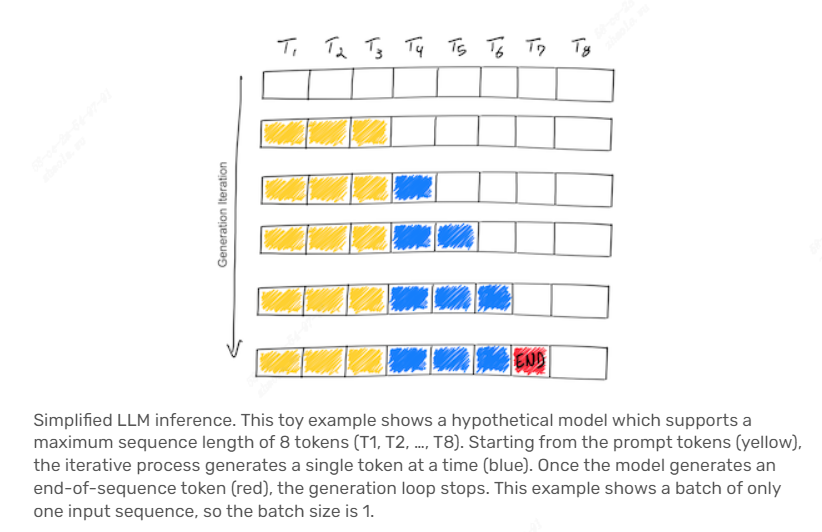
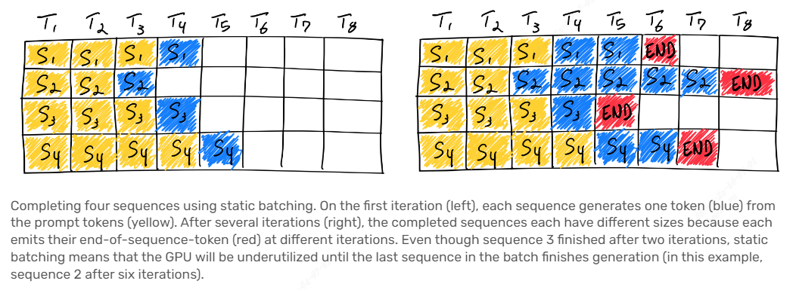
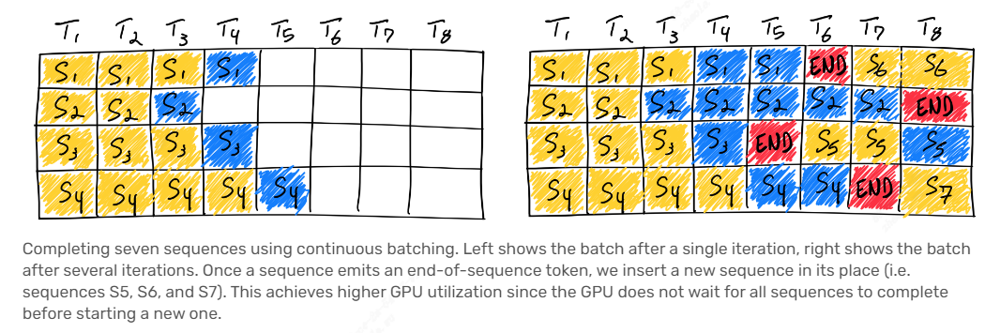

# [How continuous batching enables 23x throughput in LLM inference while reducing p50 latency](https://www.anyscale.com/blog/continuous-batching-llm-inference)

## The basics of LLM inference
LLM推理的大致流程如下：
1. 用户提供一个token序列（被称为prefix或者prompt）；
2. LLM以自回归的方式不断地预测下一个token，直到产生结束token或者到达预设的最大token数量。

LLM推理具有如下的事实：
1. 输入token序列的prefill所花费的时间与后续生成每个token的时间差不多。因为prefill阶段一些输入的attention保持常数在推理的过程中，prefill阶段有效利用GPU的并行计算。
2. LLM推理受内存IO限制，而不是计算限制。
3. GPU显存消耗受模型大小和token序列的长度影响。

Continuous batching是一种不需要修改模型的内存优化技术。

## Naive batching / static batching
传统的batching方法也被称为static batching，因为batch的大小在推理完成前是固定的。相较于其他深度学习领域，batching对LLM并不简单，因为用户的输入和模型的输出长度是不固定，导致GPU利用率下降。

## Continuous batching
Continuous batching改进naive batching，不会等待batch内所有的序列预测结束，当其中的某个序列预测结束，一个新的输入序列将被插入该序列的位置。

## Code
* [anyscale/llm-continuous-batching-benchmarks](https://github.com/anyscale/llm-continuous-batching-benchmarks)
* [vllm_example](https://github.com/ray-project/ray/blob/cc983fc3e64c1ba215e981a43dd0119c03c74ff1/doc/source/serve/doc_code/vllm_example.py)