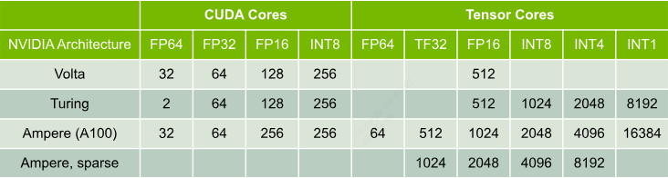

# [GPU Performance Background User's Guide](https://docs.nvidia.com/deeplearning/performance/dl-performance-gpu-background/index.html#undefined)

## Abstract

本指南提供了有关GPU结构的背景知识，操作是如何执行的，以及深度学习操作的常见限制。

## 1.Overview

在推理特定层或神经网络如何有效地利用给定GPU时，理解GPU执行的基础知识是有帮助的。

本指南介绍:

- GPU的基本结构 ([GPU Architecture Fundamentals](#2gpu-architecture-fundamentals))

- 操作是如何划分并并行执行的 ([GPU Execution Model](#3gpu-execution-model))

- 如何估计算术强度的性能限制 ([Understanding Performance](#4understanding-performance))

- 深度学习操作的松散分类以及每种操作的性能限制 ([DNN Operation Categories](#5dnn-operation-categories))

## 2.GPU Architecture Fundamentals

GPU是一种高度并行的处理器架构，由处理单元和内存层次结构组成。在高层次上，nvidia GPU由许多 Stream MultiProcessor (SM)、片上L2缓存和高带宽DRAM组成。算术和其他指令由SM执行;数据和代码通过L2缓存从DRAM访问。例如，NVIDIA A100 GPU包含108个SMs, 40MB L2缓存，可提供2039gb /s的带宽的80GB HBM2内存。

每个SM都有自己的指令调度程序和各种指令执行管道。乘-加是现代神经网络中最常见的操作，作为全连接层和卷积层的构建块，两者都可以被视为向量点积的集合。下表显示了在NVIDIA最新的GPU架构上，单个SM对于不同数据类型的每个时钟的乘法加操作。每个乘法加操作包括两个操作，因此可以将表中的吞吐量乘以2来获得每个时钟的FLOP计数。为了得到GPU的FLOPS速率，然后将这些乘以SM的数量和SM时钟速率。例如，具有108个SM和1.41 GHz时钟速率的A100 GPU的峰值密度吞吐量为156 TF32 TFLOPS和312 FP16 TFLOPS(应用程序实现的吞吐量取决于本文档中讨论的许多因素)。

## 3.GPU Execution Model

为了利用它们的并行资源，gpu并发地执行多个线程。

有两个概念对于理解线程数与GPU性能的关系至关重要:

1. GPU使用2级线程层次结构执行函数。给定函数的线程被分组到大小相等的线程块中，并启动一组线程块来执行函数。

2. GPU通过切换到执行其他线程来隐藏相关指令延迟。因此，有效利用GPU所需的线程数量远远高于内核或指令管道的数量。

2级线程层次结构是GPU具有许多SM的结果，每个SM依次具有执行许多线程的管道，并使其线程能够通过共享内存和同步进行通信。在运行时，将线程块放在SM上执行，从而使线程块中的所有线程能够有效地通信和同步。使用单个线程块启动函数只会将工作交给单个SM，因此要充分利用具有多个SMs的GPU，需要启动多个线程块。由于SM可以并发地执行多个线程块，因此通常希望线程块的数量比SM的数量高几倍。这样做的原因是为了最小化“尾部”效应，即在函数执行结束时，只剩下几个活动线程块，从而在这段时间内未充分利用GPU，如x下图所示。

当12个线程块(每次占用1块/SM)启动执行时，GPU有8个SM。在这里，线程块分两波执行，第一波利用了100%的GPU，而第二波只利用了50%。

我们使用wave这个术语来指代并发运行的一组线程块。执行的函数x需要执行几个线程块波是最有效的——在尾波中花费的时间比例更小，从而最大限度地减少了尾部效应，因此不需要为此做任何事情。对于高端GPU，通常只有线程块少于300的启动才应该检查尾部效应。

## 4.Understanding Performance

在给定的处理器上，性能受到以下三个因素之一的限制：内存带宽，计算带宽和延迟。

考虑一个简单的函数，从内存中读取输入，执行运算，然后将输出写入内存。

$T_{mem}$ 表示花在访问内存上的时间。$T_{math}$ 表示花在运算上的时间。如果我们进一步假设不同线程的内存访问和计算部分可以重叠，则该函数的总时间为 $\max~(T_{mem}, T_{math})$。两个时间中的较长时间说明了什么限制了性能：如果计算时间较长，我们说函数是计算限制的，如果内存时间较长，那么它是内存限制的。

在内存或运算上花费多少时间取决于算法及其实现，以及处理器的带宽。内存时间等于内存中访问的字节数除以处理器的内存带宽。计算时间等于运算次数除以处理器的计算带宽。因此，在给定的处理器上，给定的算法是计算限制的，如果 $ T_{math} > T_{mem} $, 即 $ \#ops / BW_{math} > \#bytes / BW_{mem} $。

通过简单代数，可以将不等式重新排列为 $\#ops / \#bytes > BW_{math} / BW_{mem}$

左边是算法实现操作和访问字节数的比率，称为算法的算术强度。右边是处理器的计算带宽和内存带宽之比，有时称为 ops:byte 比率。因此，如果算法的算术强度高于处理器的 ops:byte 比率，则该算法在给定的处理器上受到计算限制。

相反，如果算法的算术强度低于处理器的 ops:byte 比率，则该算法是内存限制的。

下面的表列出了一些来自深度神经网络的具体例子。对于这些示例，我们将把算法的算术强度与NVIDIA Volta V100 GPU上的ops:byte比率进行比较。V100的峰值计算速率为125 FP16 Tensor TFLOPS，片外存储器带宽约为900 GB/s，片上L2带宽3.1 TB/s，根据操作数据的来源(片上或片外存储器)，使其 ops:byte 比率在40到139之间。

如表所示，许多常见操作具有较低的算术强度—有时每个从内存中读取和写入的双字节元素只执行一次计算。注意，这种类型的分析是一种简化，因为我们只计算使用的算法操作。在实际操作中，函数还包含算法中未明确表示的操作指令，如内存访问指令、地址计算指令、控制流指令等。

计算强度和ops:byte比率分析假设工作负载足够大，足以使给定处理器的数学和内存管道饱和。但是，如果工作负载不够大，或者没有足够的并行性，处理器将得不到充分利用，性能将受到延迟的限制。例如，考虑启动一个线程，它将访问16个字节并执行16000个数学操作。虽然算术强度为1000 FLOPS/B，并且在V100 GPU上的执行应该受到数学限制，但只创建一个线程，严重浪费了GPU，使几乎所有的计算管道和执行资源闲置。此外，计算强度假设输入和输出只从内存访问一次。算法多次读取输入元素十分罕见，这将降低计算强度。因此，计算强度是一阶近似；如果需要更准确的分析，应该使用分析器。

## 5.DNN Operation Categories

虽然现代神经网络是由各种层构建的，但根据计算的性质，它们的操作可分为三大类。

1. Elementwise操作

   Elementwise操作可以是一元或二元操作；这一类操作中，对张量中每个元素执行数学运算独立于张量中的所有其他元素。

   例如，对于输入张量中的每个 $x$, ReLU层返回 $max(0, x)$。类似地，两个张量的Elementwise加法独立于其他和的计算。这类层包括大多数非线性(sigmoid、tanh等)、缩放、偏置、加法等。这些层往往是内存限制的，因为它们对每个访问的字节执行的操作很少。

2. Reduction操作

   Reduction操作在输入张量值范围内计算的值。

   例如，池化层计算输入张量中某些邻域的值。批处理归一化计算张量的均值和标准差，然后在每个输出元素的操作中使用它们。除了池化层和归一化层，softMax还属于reduction操作。典型的约简操作算术强度低，因此内存限制。

3. 点积操作

   这类操作可以表示为两个张量元素的点积，通常是一个权重(学习参数)张量和一个激活张量。

   这包括全连接层，它们独立出现，也可以作为RNN和attention的组成部分。全连接层自然地表示为矩阵-向量和矩阵-矩阵乘法。卷积也可以表示为点积的集合——一个向量是给定滤波器的参数集，另一个向量是“展开”的激活张量。由于滤波器应用于多个位置，卷积也可以看作是矩阵-向量或矩阵-矩阵乘法运算。

   如果相应的矩阵足够大，则点积范畴中的操作可能是有计算限制的。但是，对于较小的矩阵，这些操作最终会受到内存限制。例如，应用于单个向量(批大小为1的张量)的全连接层是内存限制的。

## 6.Summary

为了大致了解是什么限制了给定GPU上特定功能的性能，可以采取以下步骤:

- 查找GPU上的SM数量，并确定GPU的ops:bytes比率。

- 计算算法的计算强度。

- 通过估计线程块的数量和大小来确定是否有足够的并行性使GPU饱和。如果线程块的数量至少大约是SM数量的4倍，并且每个线程块由几百个线程组成，那么可能存在足够的并行性。

- 最有可能的性能限制因素是:

  - 延迟，如果没有足够的并行

  - 计算，如果有足够的并行性，且计算强度要高于GPU的ops:byte比率

  - 内存，如果有足够的并行性，且计算强度低于GPU的ops:byte比率。
  