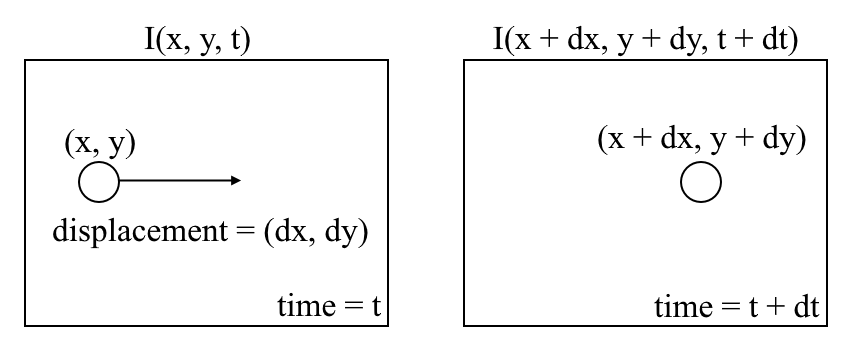
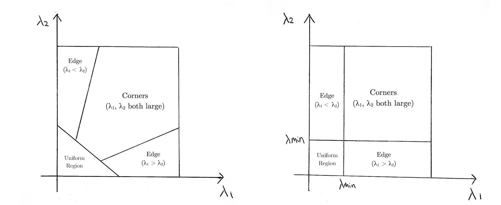

# Introduction to Motion Estimation with Optical Flow

计算机视觉研究的最新突破使机器能够通过物体检测(用于检测属于某一类的物体实例)和语义分割(用于像素分类)等技术来感知周围世界。

然而，对于处理实时视频输入，这些技术的大多数实现只处理同一帧内对象的关系，而忽略了时间信息。换句话说，它们独立地重新评估每个帧，就好像它们是完全不相关的图像一样。然而，如果我们确实需要连续帧之间的关系，例如，我们想要跟踪车辆跨帧的运动以估计其当前速度并预测其在下一帧中的位置，该怎么办？或者，如果我们需要连续帧之间的人体姿势关系信息来识别射箭、棒球和篮球等人类动作，该怎么办?

在本教程中，我们深入了解光流的基础知识，看看它的一些应用程序并实现它的两个主要变体(稀疏和密集)。我们还简要讨论了使用深度学习的最新方法和有希望的未来方向。

## What is optical flow?

让我们从对光流的高层次理解开始。光流是物体在连续的序列帧之间的运动，该运动是由物体和相机之间的相对运动引起的。光流问题可以表示为:



其中，在连续帧之间，我们可以将图像强度 $I$ 表示为空间 $(x,y)$ 和时间 $t$ 的函数。换句话说，如果我们取第一张图像 $I(x,y,t)$，并将其像素在 $t$ 时间内移动 $(dx,dy)$，我们得到新的图像 $I(x+dx,y+dy,t+dt)$。

首先，我们假设一个对象的像素强度在连续的帧之间是恒定的。

$$ I(x, y, t) = I(x+dx,y+dy,t+dt) $$

其次，上式进行泰勒级数近似，去掉公项。

$$ I(x+dx,y+dy,t+dt) = I(x,y,t)+\frac{\partial I}{\partial x} dx+\frac{\partial I}{\partial y} dy+\frac{\partial I}{\partial t} dt + \cdot $$

$$ \frac{\partial I}{\partial x} dx+\frac{\partial I}{\partial y} dy+\frac{\partial I}{\partial t} dt = 0 $$

第三，除以 $dt$ 推导出光流方程:

$$ \frac{\partial I}{\partial x} u +\frac{\partial I}{\partial y} v+\frac{\partial I}{\partial t} = 0 $$

其中 $u = \partial x / \partial t, v = \partial y / \partial t$。

$\partial I/\partial x,\partial I/\partial y,\partial I/\partial t$ 为图像沿水平轴、垂直轴和时间梯度。

因此，我们总结光流问题，即求解 $u$ 和 $v$ 来确定随时间的运动。你可能会注意到，我们不能直接解的光流方程 $u$ 和 $v$ 因为有两个未知变量但只有一个方程。我们将实现一些方法，如Lucas-Kanade方法来解决这个问题。

## Sparse vs Dense Optical Flow

稀疏光流给出了帧内一些“有趣特征”的流向量(比如描绘物体边缘或角落的几个像素)，而密集光流给出了整个帧(所有像素)的流向量——每个像素最多一个流向量。正如你所猜测的那样，密集光流具有更高的精度，但代价是速度慢/计算成本高。

## Implementing Sparse Optical Flow

稀疏光流选择一个稀疏的像素特征集(如边缘和角等有趣的特征)来跟踪其速度向量(运动)。提取的特征在光流函数中逐帧传递，以确保跟踪相同的点。稀疏光流有多种实现方法，包括Lucas-Kanade方法、Horn-Schunck方法、Buxton-Buxton方法等等。我们将使用OpenCV(一个开源的计算机视觉算法库)的Lucas-Kanade方法来实现。

1. 设置开发环境

   如果你还没有安装OpenCV，打开Terminal并运行:
   
   ```shell
   pip install opencv-python
   ```
   
   现在，运行以下命令克隆教程存储库:
   
   ```shell
   git clone https://github.com/chuanenlin/optical-flow.git
   ```

   接下来，用文本编辑器打开 `sparse-starter.py`。我们将在这个Python文件中编写所有代码。

2. 配置OpenCV读取视频和设置参数

   ```python
   import cv2 as cv
   import numpy as np
   
   # Parameters for Shi-Tomasi corner detection
   feature_params = dict(maxCorners = 300, qualityLevel = 0.2, minDistance = 2, blockSize = 7)
   # Parameters for Lucas-Kanade optical flow
   lk_params = dict(winSize = (15,15), maxLevel = 2, criteria = (cv.TERM_CRITERIA_EPS | cv.TERM_CRITERIA_COUNT, 10, 0.03))
   # The video feed is read in as a VideoCapture object
   cap = cv.VideoCapture("shibuya.mp4")
   # Variable for color to draw optical flow track
   color = (0, 255, 0)
   # ret = a boolean return value from getting the frame, first_frame = the first frame in the entire video sequence
   ret, first_frame = cap.read()
   
   while True:
       # ret = a boolean return value from getting the frame, frame = the current frame being projected in the video
       ret, frame = cap.read()
       if not ret: break
       cv.imshow('frame', frame)
       # Frames are read by intervals of 10 milliseconds. The programs breaks out of the while loop when the user presses the 'q' key
       if cv.waitKey(10) & 0xFF == ord('q'):
           break
   # The following frees up resources and closes all windows
   cap.release()
   cv.destroyAllWindows()
   ```

3. 灰度图

   ```python
   import cv2 as cv
   import numpy as np
   
   # Parameters for Shi-Tomasi corner detection
   feature_params = dict(maxCorners = 300, qualityLevel = 0.2, minDistance = 2, blockSize = 7)
   # Parameters for Lucas-Kanade optical flow
   lk_params = dict(winSize = (15,15), maxLevel = 2, criteria = (cv.TERM_CRITERIA_EPS | cv.TERM_CRITERIA_COUNT, 10, 0.03))
   # The video feed is read in as a VideoCapture object
   cap = cv.VideoCapture("shibuya.mp4")
   # Variable for color to draw optical flow track
   color = (0, 255, 0)
   # ret = a boolean return value from getting the frame, first_frame = the first frame in the entire video sequence
   ret, first_frame = cap.read()
   # Converts frame to grayscale because we only need the luminance channel for detecting edges - less computationally expensive
   prev_gray = cv.cvtColor(first_frame, cv.COLOR_BGR2GRAY)
   
   while True:
       # ret = a boolean return value from getting the frame, frame = the current frame being projected in the video
       ret, frame = cap.read()
       if not ret: break
       gray = cv.cvtColor(frame, cv.COLOR_BGR2GRAY)
       cv.imshow("grayscale", gray)
       # Frames are read by intervals of 10 milliseconds. The programs breaks out of the while loop when the user presses the 'q' key
       if cv.waitKey(10) & 0xFF == ord('q'):
           break
   # The following frees up resources and closes all windows
   cap.release()
   cv.destroyAllWindows()
   ```

4. Shi-Tomasi角检测器 - 选择要跟踪的像素

   对于稀疏光流的实现，我们只跟踪一个像素特征集的运动。图像中的特征是表示丰富信息的兴趣点。例如，这些特征可能是图像中不受平移、缩放、旋转和强度变化(如角)影响的点。

   Shi-Tomasi角检测器与流行的Harris角检测器非常相似，可以通过以下三个程序实现:

   1. 确定在x和y方向上平移时具有大梯度(图像强度变化)的窗口(小图像块)。

   2. 对于每个窗口，计算一个分数 $R$。

   3. 根据值 $R$，每个窗口被分类为平面、边缘或角落。

   如果您想了解更多关于哈里斯角探测器的一步一步的数学解释，请随意浏览这些[幻灯片](https://courses.cs.washington.edu/courses/cse576/06sp/notes/HarrisDetector.pdf)。

   Shi和Tomasi后来在他们的论文[Good Features to Track](https://www.researchgate.net/publication/2239823_Good_Features_to_Track)中对哈里斯角探测器做了一个小而有效的修改。

   修改的是分数的方程式R计算。在Harris角点检测器中，评分函数为:

   $$ R = det M - k(trace \ M)^2$$

   $$ det M = \lambda_1 \lambda_2$$

   $$ trace M = \lambda_1 + \lambda_2$$

   Shi-Tomasi提出的评分函数为:

   $$ R = min(\lambda_1, \lambda_2)$$

   $R$ 大于某一阈值，则归类为角。下图比较了Harris(左)和Shi-Tomasi(右)的分数在 $\lambda_1 - \lambda2$ 空间。

   

   对于Shi-Tomasi来说，只有当 $\lambda_1$ 和 $\lambda_2$ 都超过了最低阈值，窗口才被归类为角。

   可以在[这里](https://docs.opencv.org/3.0-beta/modules/imgproc/doc/feature_detection.html#goodfeaturestotrack)找到OpenCV通过 `goodFeaturesToTrack()` 实现Shi-Tomasi的文档。

5. Lucas-Kanade: 稀疏光流

   Lucas和Kanade在[他们的论文](https://www.ri.cmu.edu/pub_files/pub3/lucas_bruce_d_1981_2/lucas_bruce_d_1981_2.pdf)中提出了一种通过比较两个连续帧来估计有趣特征运动的有效技术。Lucas-Kanade方法在以下假设下工作:

   1. 两个连续的帧被一个小的时间增量间隔，这样对象就不会明显移位(换句话说，该方法最适合缓慢移动的对象)。

   2. 一个图像描绘了一个“自然”的场景，有纹理的物体呈现出平滑变化的灰色阴影。

   首先，在这些假设下，我们可以在Shi-Tomasi检测到的特征周围取一个小的3x3窗口(邻域)，并假设所有九个点都具有相同的运动。这可以表示为

   $$
   \begin{align*}
   I_x(q_1)V_x+I_y(q_1)V_y &= -I_t(q_1) \\
   I_x(q_2)V_x+I_y(q_2)V_y &= -I_t(q_2) \\
   \vdots \\
   I_x(q_n)V_x+I_y(q_n)V_y &= -I_t(q_n)
   \end{align*}
   $$

   其中 $q_1,q_2,\cdots, q_n$ 为窗口中的像素（例如 3x3的窗口 $n=9$），$I_x(q_i),I_y(q_i),I_t(q_i)$ 为图像 $I$ 对于 $x,y,t$ 的偏导数在像素 $q_i$ 和当前时刻的值。

   这只是n个像素的光流方程(我们之前描述过)。方程组可以用下面的矩阵形式表示，$Av=b$，其中:

   $$
    A = \begin{bmatrix}
        I_x(q_1) & I_y(q_1) \\
        I_x(q_2) & I_y(q_2) \\
        \vdots & \vdots \\
        I_x(q_n) & I_y(q_n) \\
        \end{bmatrix} \quad
    v = \begin{bmatrix}
        V_x \\
        V_y \\
        \end{bmatrix} \quad
    b = \begin{bmatrix}
        -I_t(q_1) \\
        -I_t(q_2) \\
        \vdots \\
        -I_t(q_n) \\
        \end{bmatrix}
   $$

   请注意，前面(参见“什么是光流?”一节)，我们面临必须用一个方程求解两个未知变量的问题。我们现在要解两个未知数，这是过度确定的。

   其次，为了解决过确定问题，我们应用最小二乘拟合得到以下等式:
   
   $$
   \begin{bmatrix}
    V_x \\
    V_y \\
    \end{bmatrix} = \begin{bmatrix}
     \Sigma_i I_x(q_i)^2 & \Sigma_i I_x(q_i)I_y(q_i) \\
     \Sigma_i I_y(q_i)I_x(q_i) & \Sigma_i I_y(q_i)^2
    \end{bmatrix}^{-1} \begin{bmatrix} 
     -\Sigma_i I_x(q_i)I_t(q_i) \\
     -\Sigma_i I_y(q_i)I_t(q_i)
    \end{bmatrix}
   $$

   其中 $V_x = u = \partial x / \partial t$ 表示的 $x$ 方向的速度，$V_y = u = \partial y / \partial t$ 表示的 $y$ 方向的速度。求解这两个变量就完成了光流问题。

   简而言之，我们确定了一些有趣的特征来跟踪和迭代计算这些点的光流向量。然而，采用Lucas-Kanade方法只适用于小的运动(根据我们最初的假设)，当有大的运动时就失败了。因此，OpenCV的Lucas-Kanade方法的实现采用图像金字塔。

   当我们沿着金字塔上升（图片分辨率减小）时，小的运动被忽略，大的运动被减少到小的运动。关于OpenCV实现的全面数学解释可以在[Bouguet的笔记](http://robots.stanford.edu/cs223b04/algo_tracking.pdf)中找到，OpenCV通过 `calcOpticalFlowPyrLK()` 实现Lucas-Kanade方法的文档可以在[这里](https://docs.opencv.org/3.0-beta/modules/video/doc/motion_analysis_and_object_tracking.html#calcopticalflowpyrlk)找到。

6. 可视化

   ```python
   import cv2 as cv
   import numpy as np
   
   # Parameters for Shi-Tomasi corner detection
   feature_params = dict(maxCorners = 300, qualityLevel = 0.2, minDistance = 2, blockSize = 7)
   # Parameters for Lucas-Kanade optical flow
   lk_params = dict(winSize = (15,15), maxLevel = 2, criteria = (cv.TERM_CRITERIA_EPS | cv.TERM_CRITERIA_COUNT, 10, 0.03))
   # The video feed is read in as a VideoCapture object
   cap = cv.VideoCapture("shibuya.mp4")
   # Variable for color to draw optical flow track
   color = (0, 255, 0)
   # ret = a boolean return value from getting the frame, first_frame = the first frame in the entire video sequence
   ret, first_frame = cap.read()
   # Converts frame to grayscale because we only need the luminance channel for detecting edges - less computationally expensive
   prev_gray = cv.cvtColor(first_frame, cv.COLOR_BGR2GRAY)
   # Finds the strongest corners in the first frame by Shi-Tomasi method - we will track the optical flow for these corners
   # https://docs.opencv.org/3.0-beta/modules/imgproc/doc/feature_detection.html#goodfeaturestotrack
   prev = cv.goodFeaturesToTrack(prev_gray, mask = None, **feature_params)
   # Creates an image filled with zero intensities with the same dimensions as the frame - for later drawing purposes
   mask = np.zeros_like(first_frame)
   
   while(cap.isOpened()):
       # ret = a boolean return value from getting the frame, frame = the current frame being projected in the video
       ret, frame = cap.read()
       # Converts each frame to grayscale - we previously only converted the first frame to grayscale
       gray = cv.cvtColor(frame, cv.COLOR_BGR2GRAY)
       # Calculates sparse optical flow by Lucas-Kanade method
       # https://docs.opencv.org/3.0-beta/modules/video/doc/motion_analysis_and_object_tracking.html#calcopticalflowpyrlk
       prev = cv.goodFeaturesToTrack(prev_gray, mask = None, **feature_params)
       next, status, error = cv.calcOpticalFlowPyrLK(prev_gray, gray, prev, None, **lk_params)
       # Selects good feature points for previous position
       good_old = prev[status == 1].astype(int)
       # Selects good feature points for next position
       good_new = next[status == 1].astype(int)
       # Draws the optical flow tracks
       for i, (new, old) in enumerate(zip(good_new, good_old)):
           # Returns a contiguous flattened array as (x, y) coordinates for new point
           a, b = new.ravel()
           # Returns a contiguous flattened array as (x, y) coordinates for old point
           c, d = old.ravel()
           # Draws line between new and old position with green color and 2 thickness
           mask = cv.line(mask, (a, b), (c, d), color, 2)
           # Draws filled circle (thickness of -1) at new position with green color and radius of 3
           frame = cv.circle(frame, (a, b), 3, color, -1)
       # Overlays the optical flow tracks on the original frame
       output = cv.add(frame, mask)
       # Updates previous frame
       prev_gray = gray.copy()
       # Updates previous good feature points
       prev = good_new.reshape(-1, 1, 2)
       # Opens a new window and displays the output frame
       cv.imshow("sparse optical flow", output)
       # Frames are read by intervals of 10 milliseconds. The programs breaks out of the while loop when the user presses the 'q' key
       if cv.waitKey(10) & 0xFF == ord('q'):
           break
   # The following frees up resources and closes all windows
   cap.release()
   cv.destroyAllWindows()
   ```

## Implementing Dense Optical Flow

我们之前已经计算了像素稀疏特征集的光流。密集光流试图计算每帧的每个像素的光流矢量。虽然这样的计算可能会较慢，但它给出了更准确和更密集的结果，适合于从运动和视频分割中学习结构等应用。密集光流有多种实现方式。我们将使用最流行的实现方法之一Farneback方法，并使用OpenCV来实现。

前三步同稀疏光流。

4. Farneback Optical Flow

Gunnar Farneback在他的[论文](http://www.diva-portal.org/smash/get/diva2:273847/FULLTEXT01.pdf)中提出了一种通过比较连续两帧来估计感兴趣特征运动的有效方法。

首先，该方法通过多项式展开变换，用二次多项式逼近图像帧的窗口(详见Lucas Kanade稀疏光流实现章节)。其次，通过观察多项式在平移(运动)下的变换，定义了一种利用多项式展开系数估计位移场的方法。经过一系列的改进，计算出密集光流。Farneback的论文非常简明易懂，所以如果你想更深入地理解它，我强烈建议你阅读一下这篇论文。

对于OpenCV的实现，它从两个通道的流向量阵列 $dx/dt, dy/dt$ 中计算光流的大小和方向。然后通过hue可视化光流的角度(方向)，通过HSV颜色表示的值可视化光流的距离(大小)。为了获得最佳可视性，HSV的强度总是设置为255的最大值。OpenCV通过 `calcOpticalFlowFarneback()` 实现Farneback方法的文档可以在[这里](https://docs.opencv.org/3.0-beta/modules/video/doc/motion_analysis_and_object_tracking.html#calcopticalflowfarneback)找到。

5. 可视化

   ```python
   import cv2 as cv
   import numpy as np

   # The video feed is read in as a VideoCapture object
   cap = cv.VideoCapture("shibuya.mp4")
   # ret = a boolean return value from getting the frame, first_frame = the first frame in the entire video sequence
   ret, first_frame = cap.read()
   # Converts frame to grayscale because we only need the luminance channel for detecting edges - less computationally expensive
   prev_gray = cv.cvtColor(first_frame, cv.COLOR_BGR2GRAY)
   # Creates an image filled with zero intensities with the same dimensions as the frame
   mask = np.zeros_like(first_frame)
   # Sets image saturation to maximum
   mask[..., 1] = 255

   while(cap.isOpened()):
       # ret = a boolean return value from getting the frame, frame = the current frame being projected in the video
       ret, frame = cap.read()
       # Opens a new window and displays the input frame
       cv.imshow("input", frame)
       # Converts each frame to grayscale - we previously only converted the first frame to grayscale
       gray = cv.cvtColor(frame, cv.COLOR_BGR2GRAY)
       # Calculates dense optical flow by Farneback method
       # https://docs.opencv.org/3.0-beta/modules/video/doc/motion_analysis_and_object_tracking.html#calcopticalflowfarneback
       flow = cv.calcOpticalFlowFarneback(prev_gray, gray, None, 0.5, 3, 15, 3, 5, 1.2, 0)
       # Computes the magnitude and angle of the 2D vectors
       magnitude, angle = cv.cartToPolar(flow[..., 0], flow[..., 1])
       # Sets image hue according to the optical flow direction
       mask[..., 0] = angle * 180 / np.pi / 2
       # Sets image value according to the optical flow magnitude (normalized)
       mask[..., 2] = cv.normalize(magnitude, None, 0, 255, cv.NORM_MINMAX)
       # Converts HSV to RGB (BGR) color representation
       rgb = cv.cvtColor(mask, cv.COLOR_HSV2BGR)
       # Opens a new window and displays the output frame
       cv.imshow("dense optical flow", rgb)
       # Updates previous frame
       prev_gray = gray
       # Frames are read by intervals of 1 millisecond. The programs breaks out of the while loop when the user presses the 'q' key
       if cv.waitKey(1) & 0xFF == ord('q'):
           break
   # The following frees up resources and closes all windows
   cap.release()
   cv.destroyAllWindows()
   ```

## Optical Flow using Deep Learning

虽然光流问题在历史上一直是一个优化问题，但最近应用深度学习的方法已经显示出令人印象深刻的结果。这种方法一般以两帧视频作为输入，输出光流(彩色编码图像)，它可以表示为如下公式:

$$ (u, v) = f(I_{t-1}, I_t) $$

其中 $u,v$ 是 $x,y$方向的速度，$f$ 为神经网络，以相邻两帧图像作为输入。

利用深度神经网络计算光流需要大量的训练数据，而训练数据的获取尤为困难。这是因为标记视频片段的光流需要准确地计算出图像中每个点的确切运动，达到亚像素精度。为了解决标记训练数据的问题，研究人员使用计算机图形来模拟大量的现实世界。由于世界是由指令生成的，因此视频序列中图像中每个点的运动都是已知的。这方面的一些例子包括 MPI-Sintel，这是一个开源的CGI电影，带有各种序列的光流标记，以及Flying Chairs，这是一个由许多椅子在随机背景上飞行的数据集，也带有光流标记。

目前，用深度学习解决光流问题是一个非常热门的话题，FlowNet、SPyNet、PWC-Net等各种变体在各种基准测试中都表现出色。

### 光流应用

- 语义分割

  光流场是观测场景信息的巨大宝库。随着精确测定光流技术的进步，将光流与其他几个基本的计算机视觉任务结合起来的应用是很有趣的。例如，语义分割的任务是将图像划分为一系列对应于唯一对象类的区域，而具有相同纹理的紧密放置的对象通常是单帧分割技术的难点。然而，如果物体被分开放置，物体的不同运动可能非常有用，因为密集光流场中的不连续对应于物体之间的边界。
  
- 目标检测与跟踪

  光流的另一个有前途的应用可能是物体检测和跟踪，或者在高级形式下，用于构建[实时车辆跟踪和交通分析系统](https://nanonets.com/blog/optical-flow/#implementing-sparse-optical-flow)。由于稀疏光流利用感兴趣点的跟踪，这种实时系统可以通过基于特征的光流技术从固定相机或附加在车辆上的相机执行。

## Conclusion

从根本上说，光流矢量可以作为无数需要对视频序列进行场景理解的高级任务的输入，而这些任务可以进一步作为更复杂系统(如面部表情分析、自动驾驶汽车导航等)的构建块。