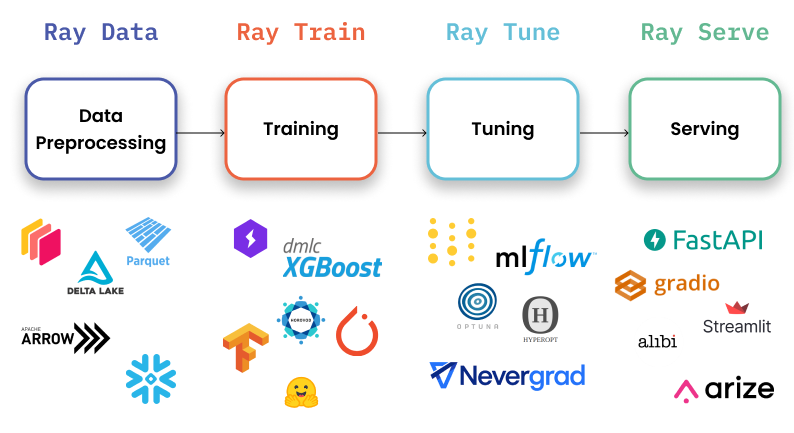

# [Introduction to Ray AI Runtime (AIR)](https://github.com/ray-project/ray-educational-materials/blob/main/Introductory_modules/Introduction_to_Ray_AI_Runtime.ipynb)

## 学习目标

- 了解组成Ray AIR的高级ML库

  - Data

  - Train

  - Tune

  - Serve

  - RLlib (未深入介绍)

- 使用Ray AIR作为统一的工具包来编写端到端的ML应用程序。

- 扩展这里提供的迷你示例，使用Ray AIR在Python中扩展单个工作负载。

- 确定Ray AIR试图解决的问题和挑战。

## 你会做什么

通过动手练习，您将从示例ML工作流的每个阶段练习关键概念。

| ML工作流阶段 | Ray AIR 关键概念 |
| --- | --- |
| **数据加载和预处理** | 用于加载和转换数据的 `Preprocessor` |
| **模型训练** | 支持ML框架（Keras，Torch等）的 `Trainer` |
| **超参数调优** | 用于调整超参数的 `Tuner` |
| **批量推理** | 用于加载模型并批量推理的 `BatchPredictor`  |
| **模型服务** | 用于在线推理的 `PredictorDeployment` |

## Ray AI Runtime (AIR) 概述

**Ray AI Runtime (AIR)是一个开源的、基于python的、特定领域的库，它为机器学习工程师、数据科学家和研究人员提供了一个可扩展的、统一的机器学习应用程序工具包。**

Ray AIR建立在Ray Core之上，继承了Core提供的所有性能和可扩展性优势，同时为机器学习提供了方便的抽象层。Ray AIR的python优先原生库允许机器学习从业者分发个人工作负载、端到端应用程序，并在统一框架中构建自定义用例。

### 使用Ray AIR的机器学习工作流

Ray AIR封装了5个原生Ray库，它们可以扩展ML工作流的特定阶段。此外，Ray AIR将一个不断增长的生态系统与流行的机器学习框架集成在一起，以创建一个通用的开发接口。

Ray AIR支持端到端机器学习开发，并提供多种选项，可与MLOps生态系统中的其他工具和库集成。

1. Ray Data: 跨训练、调优和预测的可伸缩的、与框架无关的数据加载和转换。

2. Ray Train: 具有容错的分布式多节点和多核模型训练，集成了流行的机器学习训练库。

3. Ray Tune: 拓展超参数调优以优化模型性能。

4. Ray Serve: 为在线推理部署一个模型或模型集合。

5. Ray RLlib: 与其他Ray AIR库集成扩展强化学习工作负载。

## 使用Ray AI Runtime的端到端工作流程

为了说明Ray AIR的功能，您将实现一个端到端机器学习应用程序，该应用程序使用纽约市出租车数据预测小费。每一节将介绍相关的Ray AIR库或组件，并通过代码示例演示其功能。

对于这个分类任务，您将应用一个简单的XGBoost模型到2021年6月的[纽约市出租车和豪华轿车委员会的旅行记录数据](https://www.nyc.gov/site/tlc/about/tlc-trip-record-data.page)。这个数据集包含超过200万个黄色出租车的样本，目标是预测一次旅行的小费是否会超过20%。

该数据的特征如下：

- **passenger_count**: 浮点数(整数)，代表乘客人数。

- **trip_distance**: 浮点数，表示以英里为单位的行程距离。

- **fare_amount**: 浮动数，代表总价，包括税、小费、费用等。

- **trip_duration**: 整数，表示经过的秒数。

- **hour**: 整数，表示行程开始的小时，范围为0到23。

- **day_of_week**: 整数，表示星期几，范围为0到6。

- **is_big_tip**: 布尔值，表示小费是否超过20%。

## Ray Data

首先，您需要加载出租车数据，并将原始输入转换为经过清理的特征，以便传递给XGBoost模型。

Ray AIR封装Ray Data，在训练、调优和推理期间提供分布式数据摄取和转换。