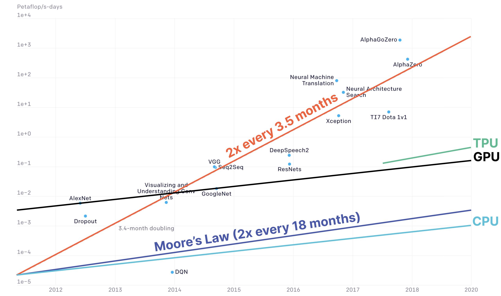
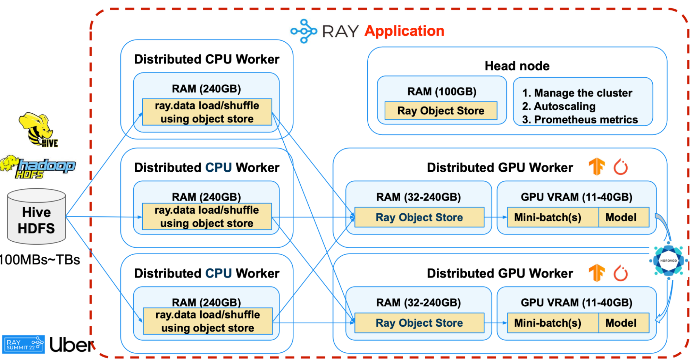
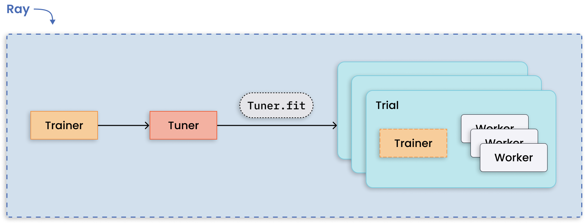
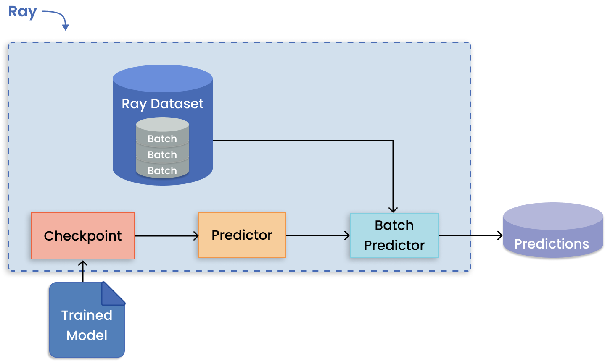

# [Overview of Ray](https://github.com/ray-project/ray-educational-materials/blob/main/Introductory_modules/Overview_of_Ray.ipynb)

## 介绍

### Ray是什么

**Ray是一个开源的统一计算框架，可以轻松拓展AI和Python工作负载。**

Ray提供计算层拓展应用程序，而无需成为分布式系统专家。以下为Ray自动处理的关键过程：

- 编排。管理分布式系统的各种组件。

- 调度。协调何时何地执行任务。

- 容错。确保任务完成，无论什么不可避免的故障点。

- 自动拓展。调整分配给动态需求的资源数量。

为了降低扩展计算密集型工作负载所需的工作量，Ray采用了Python优先的方法，并集成了许多常见的数据科学工具。这允许机器学习从业者以最小的代码更改将Python应用程序从笔记本电脑并行化到集群。

分布式计算与现代机器学习系统的关系越来越密切。OpenAI最近发表的论文[AI and Compute](https://openai.com/research/ai-and-compute)表明，自2012年以来，训练人工智能模型所需的计算量大约每3.5个月翻一番。



然而，分布式系统很难编程。将Python应用程序扩展到集群会带来通信、调度、安全性、故障处理、异构性、透明度等方面的挑战。这种背景推动了Ray的开发:Ray是一种解决方案，使开发人员能够在集群上运行Python代码，而不必考虑如何编排和利用单个机器。

### Ray的关键特性

- Python first approach

    Ray允许使用python代码中的基本元素来灵活地组合分布式应用程序。通过这种方式，可以使用最少的代码扩展现有的工作负载。开始使用Ray Core只涉及几个关键的抽象:

    1. Tasks. 远程的、无状态的Python函数；

    2. Actors. 远程的、有状态的Python类；

    3. Objects. Tasks和actors在objects上创建和计算。Objects可以在集群的任何地方存储和访问，可以在Ray的分布式共享内存对象存储中缓存；

    这些抽象将在[Ray Core](todo)进一步学习。

- 简单且灵活的API

    **Ray Core是一个开源的Python通用分布式计算库，它使机器学习工程师和Python开发人员能够扩展Python应用程序并加速机器学习工作负载。**

    作为整个生态系统的基础库，Ray Core提供了一个支持分布式计算的极简API。只需要一些方法，你就可以开始构建分布式应用程序:

  - `ray.init()`. 启动Ray运行时并连接到Ray集群。

  - `@ray.remote`. 修饰符，指定Python函数或类在不同进程中作为task(远程函数)或actor(远程类)执行。

  - `.remote`. 远程函数和类的后缀，远程操作是异步的。

  - `ray.put()`. 将对象放入内存中的对象存储区，返回一个对象引用，用于将对象传递给任何远程函数或方法调用。

  - `ray.get()`. 通过指定对象引用从对象存储区获取远程对象。

  **Ray AI Runtime (AIR)是一个开源的、Python的、特定领域的库集合，它为ML工程师、数据科学家和研究人员提供了一个可扩展的、统一的ML应用程序工具包。** Ray AI Runtime (AIR)提供了更高级的api，以满足更多特定于领域的用例。Ray AIR使数据科学家和机器学习工程师能够在Python中扩展个人工作负载，端到端工作流和流行的生态系统框架。

- 可扩展性

    Ray允许用户以一种简单、高效和资源高效的方式利用大型计算集群。

    基本上，Ray将整个集群视为一个单一的、统一的资源池，并负责将计算工作负载最佳地映射到该池。通过这样做，Ray在很大程度上消除了系统中不可扩展的因素。

    以下是一些成功的用户故事:

  - [Instacart](https://www.youtube.com/watch?v=3t26ucTy0Rs)使用Ray为他们的大规模ML流水线提供动力。

  - OpenAI训练他们的大模型。

  - [Huggingface and Cohere](https://www.youtube.com/watch?v=For8yLkZP5w)使用Ray拓展模型训练。

  Ray的autoscaler实现了基于应用程序资源需求的Ray集群的自动缩放。当Ray工作负载超过集群的容量时，自动缩放器将增加工作节点。当工作节点处于空闲状态时，自动缩放器将对其进行缩放。

- 支持异构硬件

    异构系统对分布提出了新的挑战，因为每个计算单元都有自己的编程模型。Ray原生支持异构硬件，在底层实现负载平衡、连贯性和一致性。您所需要做的就是在初始化任务或参与者时指定硬件。例如，开发人员可以在同一个应用程序中指定一个task需要128个cpu，另一个task只需要0.5个gpu，一个actor需要36个cpu和8个gpu。

    ``` python
    ray.init(num_cpus=128)

    @ray.remote(num_cpus=36, num_gpus=8)
    def train_and_score_model():
        RoBERTa_pretrained = ...
        ...
        return score

    @ray.remote(num_gpus=0.5)
    def tiny_ml():
        EfficientNet = load()
        ...
        return acc
    ```

    一个例子是Uber的深度学习管道。8个GPU节点和9个CPU节点的异构设置将管道吞吐量提高了50%，同时与16个GPU节点的传统设置相比，大大节省了资本成本。

    

### Ray libraries

Ray的统一计算框架有四层:

1. Ray cluster

2. Ray Core

3. Ray AI Runtime (native libraries)

4. Integrations and ecosystem


- Ray cluster

    **Ray cluster是一组连接到公共Ray头节点的工作节点。Ray集群可以是固定大小的，也可以根据运行在集群上的应用程序所请求的资源自动伸缩。**

    Ray从底层的集群开始，设置和管理计算机集群，以便您可以在其上运行分布式应用程序。您可以通过官方支持的KubeRay项目在AWS、GCP或Kubernetes上部署Ray集群。

- Ray Core

  **Ray Core是一个开源的Python通用分布式计算库，它使机器学习工程师和Python开发人员能够扩展Python应用程序并加速机器学习工作负载。**

  Ray Core是Ray的机器学习库(Ray AIR)和第三方集成(Ray生态系统)的基础。该库使Python开发人员能够轻松构建可扩展的分布式系统，这些系统可以在笔记本电脑、集群、云或Kubernetes上运行。

  对前面提到的关键抽象进行扩展:

  1. Tasks. 远程的、无状态的Python函数。

     Ray任务是任意的Python函数，在Ray集群节点上的独立Python工作器上异步执行。用户可以根据cpu、gpu和自定义资源来指定他们的资源需求，集群调度器使用这些资源来分发并行执行的任务。

  2. Actors. 远程的、有状态的Python类。

     Actor之于类，正如task之于函数。Actor是一个有状态的工作器，actor的方法被安排在特定的工作器上，并且可以访问和改变该工作器的状态。与task一样，actor也支持CPU、GPU和自定义资源需求。

  3. Objects. 在内存中，可以在计算集群的任何地方访问的不可变对象或值。

- Ray AI Runtime

  **Ray AI Runtime (AIR)是一个开源的、Python的、特定领域的库集合，它为ML工程师、数据科学家和研究人员提供了一个可扩展的、统一的ML应用程序工具包。**

  Ray AIR建立在Ray Core之上，专注于分布式的个人和端到端机器学习工作流程。

  

  Ray AIR封装的五个原生库中的每一个都分配一个特定的ML任务:

  1. Ray Data. 跨训练、调优和预测的可伸缩的、与框架无关的数据加载和转换。

  2. Ray Train. 与流行的训练库集成的分布式多节点多核模型容错训练。

  3. Ray Tune. 调整超参数调优以优化模型性能。

  4. Ray Serve. 部署用于在线推理的模型，使用可选的微批处理来提高性能。

  5. Ray RLib. 与其他Ray AIR库集成的分布式强化学习工作负载。

- Integrations and ecosystem libraries

  Ray集成了最流行的Python和机器学习库和框架，并且其生态系统还在不断扩大。Ray没有尝试强加新的标准，Ray允许您通过在公共接口中统一工具来扩展现有的工作负载。该接口使您能够以分布式方式运行ML任务，这是大多数相应后端所不具备的属性，或者在相同程度上不具备。

## Ray use cases

既然已经从理论上了解了Ray是什么，那么讨论Ray在实践中如此有用的原因就很重要了。在本节中，您将遇到个人、组织和公司利用Ray构建其AI应用程序的方式。

首先，您将探索Ray如何扩展常见的ML工作负载。然后，将了解一些高级实现。

### 扩展常见ML工作负载

- 多个模型的并行训练

  当你想要训练的任何给定模型都可以适合单个GPU时，那么Ray可以将每个训练运行分配给单独的Ray Task。通过这种方式，所有可用的工作器都被用来运行独立的远程训练，而不是依次运行。

  

- 大模型的分布训练

  与训练许多模型相比，模型并行性将一个大型模型划分到许多机器上进行训练。Ray Train内置了用于分发模型碎片和并行运行训练的抽象。

  

- 管理并行超参数调优实验

  运行多个超参数调优实验是一种适合于分布式计算的模式，因为每个实验都是相互独立的。Ray Tune处理分发超参数优化的难点，并提供关键功能，如检查点最佳结果、优化调度、指定搜索模式等。

  

- 强化学习

  Ray RLlib提供了对生产级分布式强化学习工作负载的支持，同时为各种各样的行业应用程序维护统一和简单的api。

- 在cpu和gpu上进行批量推理

  通过将训练模型的体系结构和权重导出到共享对象存储，可以并行化地对传入的数据批次执行推理。然后，使用这些模型副本，Ray对不同工作器的批次进行预测。

  

- 多模型组合，实现模型服务

  Ray Serve支持复杂的模型部署模式，编排多个Ray actor，其中不同的参与者为不同的模型提供推理。Serve可以处理批处理和在线推理，并且可以在生产中扩展到数千个模型。

  

- ML平台

  Merlin是Shopify建立在Ray基础上的机器学习平台。它支持分布式应用程序(如产品分类和推荐)的快速迭代和扩展。

  

  Spotify将Ray用于高级应用程序，包括为家庭播客提供个性化内容推荐和个性化Spotify Radio曲目排序。

### 实现高级ML工作负载

- Alpa. 使用Ray训练非常大的模型

  Alpa是一个Ray原生库，可以在数百个gpu上自动分区、调度和执行非常大的深度学习模型的训练和服务计算。、

- Exoshuffle. 大规模数据洗牌

  在Ray 2.0中，Exoshuffle与Ray Data集成在一起，提供了一个优于Spark的应用级shuffle系统，在100个节点上进行100TB排序时实现了82%的理论性能。

- Hamilton. 特征工程

  Hamilton是一个开源的数据流微框架，用于管理时间序列预测的特征工程。这个库由StitchFix开发，提供了可扩展的并行性，其中每个Hamilton函数都是分布式的，数据受机器内存的限制。

- Riot Games. 强化学习

  Riot Games使用Ray来构建能够在不同技能水平下进行战斗的机器人。这些强化学习agent向设计师提供额外信号，以便为玩家提供最佳体验。

## Hands-on code example - scaling regression with Ray Core

### Introduction

为了更好地了解Ray，本节将扩展一个常见ML任务：结构化数据的回归。

- Data

  您将对scikit-learn提供的加州房价数据集进行回归预测。

- Model and task

  您将使用均方误差作为度量来训练和评分随机森林模型。

  在超参数调优的轻量级版本中，您将训练许多具有不同 `n_estimators` 值的模型。首先，您将训练一个顺序版本的模型，其中每个实验一个接一个地连续执行。然后，您将使用Ray Core分发这些训练运行，以实现更好的性能和更快的模型训练。

### Sequential implementation

从一个熟悉的实现开始，一个接一个地训练各种随机森林模型。

``` python
# Preliminaries 
import time
from operator import itemgetter

import pandas as pd
from sklearn.datasets import fetch_california_housing
from sklearn.ensemble import RandomForestRegressor
from sklearn.metrics import mean_squared_error
from sklearn.model_selection import train_test_split

# Prepare dataset
X, y = fetch_california_housing(return_X_y=True, as_frame=True)
X_train, X_test, y_train, y_test = train_test_split(
    X, y, test_size=0.2, random_state=201
)

# Set number of models to train
NUM_MODELS = 20

# Implement function to train and score model
def train_and_score_model(
    train_set: pd.DataFrame,
    test_set: pd.DataFrame,
    train_labels: pd.Series,
    test_labels: pd.Series,
    n_estimators: int,
) -> tuple[int, float]:
    start_time = time.time() # measure wall time for single model training

    model = RandomForestRegressor(n_estimators=n_estimators, random_state=201)
    model.fit(train_set, train_labels)
    y_pred = model.predict(test_set)
    score = mean_squared_error(test_labels, y_pred)

    time_delta = time.time() - start_time

    print(f"n_estimators={n_estimators}, mse={score:.4f}, took: {time_delta:.2f} seconds")

    return n_estimators, score

# Implement function that runs sequential model training
def run_sequential(n_models: int) -> list[tuple[int, float]]:
    return [
        train_and_score_model(
            train_set=X_train,
            test_set=X_test,
            train_labels=y_train,
            test_labels=y_test,
            n_estimators=8 + 4 * j,
        )
        for j in range(n_models)
    ]

# Run sequential model training
mse_scores = run_sequential(n_models=NUM_MODELS)

# Analyze results
best = min(mse_scores, key=itemgetter(1))
print(f"Best model: mse={best[1]:.4f}, n_estimators={best[0]}")
```

看看训练的结果，记下训练 `NUM_MODELS` 所花费的时间。继续阅读下一节，了解如何通过分发此任务来改进运行时。

### Parallel implementation

与前面的方法相反，您现在将利用所有可用的资源并行地训练这些模型。Ray将自动检测计算机上的核心数量或集群中的资源，并分配每个定义任务。

下面的图表直观地说明了任务是如何以并行方式分配和执行的。您将注意到，这引入了一个调度器，该调度器负责管理传入请求、分配节点和检测可用资源。


- 初始化Ray运行时

  ``` python
  import ray

  if ray.is_initialized:
      ray.shutdown()

  ray.init()
  ```

  首先运行Ray .init()来启动一个新的Ray集群，看看一些有用的信息:

  - Python版本

  - Ray版本

  - Ray Dashboard的链接：一个观察工具，通过有用的指标和图表观察Ray正在做的事情。

- 将数据放入对象存储

  在分布式系统中，对象引用是指向内存中对象的指针。对象引用可用于访问存储在不同机器上的对象，从而允许它们相互通信并共享数据。

  工作器使用 `ray.put()` 来放置对象，并使用 `ray.get()` 从每个节点的对象存储中检索对象。这些对象存储形成了共享的分布式内存，使得对象在Ray集群中可用。

  

  ``` python
  X_train_ref = ray.put(X_train)
  X_test_ref = ray.put(X_test)
  y_train_ref = ray.put(y_train)
  y_test_ref = ray.put(y_test)
  ```

  通过将训练和测试数据放入Ray的对象存储中，这些对象现在可用于集群中的所有远程task和actor。

- 实现对模型的训练和评分函数

  ``` python
  @ray.remote
  def train_and_score_model(
    train_set_ref: pd.DataFrame,
    test_set_ref: pd.DataFrame,
    train_labels_ref: pd.Series,
    test_labels_ref: pd.Series,
    n_estimators: int,
  ) -> tuple[int, float]:
    start_time = time.time() # measure wall time for single model training

    model = RandomForestRegressor(n_estimators=n_estimators, random_state=201)
    model.fit(train_set_ref, train_labels_ref)
    y_pred = model.predict(test_set_ref)
    score = mean_squared_error(test_labels_ref, y_pred)

    time_delta = time.time() - start_time
    print(f"n_estimators={n_estimators}, mse={score:.4f}, took: {time_delta:.2f} seconds")

    return n_estimators, score
  ```

  注意，`train_and_score_model` 与顺序示例中的函数相同，只是这里添加了 `@ray.remote` 的装饰器，指定此函数将以分布式方式执行。

- 实现并行模型训练的函数

  ``` python
  def run_parallel(n_models: int) -> list[tuple[int, float]]:
    results_ref = [
      train_and_score_model.remote(
        train_set=X_train_ref,
        test_set=X_test_ref,
        train_labels=y_train_ref,
        test_labels=y_test_ref,
        n_estimators=8 + 4 * j,
      )
      for j in range(n_models)
    ]
    return ray.get(results_ref)
  ```

  之前定义了 `run_sequential()` 来训练 `NUM_MODELS` 并对其进行评分。将其修改为 `run_parallel()` 包括三个步骤:

  1. 向 `train_and_score_model` 添加 `.remote` 后缀

     请记住，您在前面的单元格中将此函数指定为远程任务。在Ray中，您将此后缀附加到每个远程调用。

  2. 捕获 `results_ref` 中对象引用的结果列表。

     您不需要等待结果，而是立即收到对预期将来可用的结果的引用列表。这种异步(非阻塞)调用允许程序继续执行其他操作，而可能耗时的操作可以在后台计算。

  3. 使用 `ray.get()` 访问结果

     一旦所有模型都被分配给工作器，调用对象引用 `results_ref` 列表上的 `ray.get()` 来检索完成的结果。这是一个同步(阻塞)操作，因为它等待对象上的所有计算完成。

- 并行模型训练

  ``` python
  mse_scores = run_parallel(n_models=NUM_MODELS)
  ```

- 分析结果
  
  ``` python
  best = min(mse_scores, key=itemgetter(1))
  print(f"Best model: mse={best[1]:.4f}, n_estimators={best[0]}")
  ```

- 关闭Ray运行时

  ``` python
  ray.shutdown()
  ```

  断开工作器并终止由ray.init()启动的进程。
  