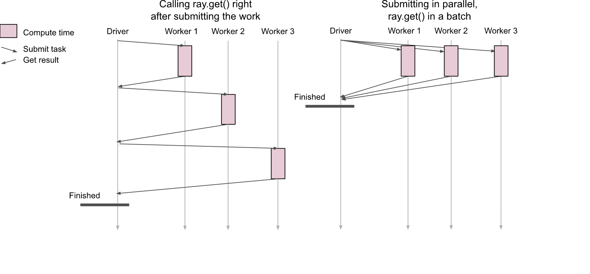
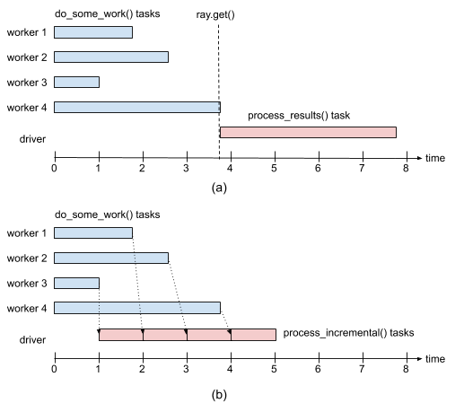

# Ray Core: Ray API Best Practices

Ray为task和actor提供了无数的设计模式和反模式。这些模式向您推荐了编写分布式应用程序的最佳实践。相反，反模式是在使用Ray时应避免的陷阱。在本教程中，我们将探索其中的一些设计模式，反模式，技巧和陷阱。

## 学习目标

在本教程中，你将学习：

- 一些设计模式和反模式

- 使用Ray api时要避免的技巧和提示

我们不会详尽地介绍所有模式和反模式。而是让您了解一些常见的陷阱。对于高级模式，请阅读有关设计模式和反模式的文档。

``` python
import logging
import math
import random
import time
from typing import List, Tuple

import numpy as np
import ray

if ray.is_initialized:
    ray.shutdown()
ray.init(logging_level=logging.ERROR)
```

## 获取集群信息

许多方法返回信息：

| 方法 | 描述 |
| --- | --- |
| ray.get_gpu_ids() | GPUs 
| ray.nodes() | 集群节点 |
| ray.cluster_resources() | 所有可获取的资源，无论是否可用 |
| ray.available_resources() | 可用资源 |

## 提示、技巧、模式和反模式

由于Ray的核心API简单而灵活，第一次使用Ray的用户可能会被Ray使用模式中的某些API调用绊倒。这些简短的提示和技巧将确保你避免意想不到的结果。下面我们将简要探讨一些API调用及其最佳实践。

### 使用@ray.remote和@ray.method返回多个参数

通常，你可能希望从ray task中返回多个参数，或者从ray actor的方法中返回多个值。让我们看一些例子，看看你是怎么做的。

``` python
@ray.remote(num_returns=3)
def tuple3(id: str, lst: List[float]) -> Tuple[str, int, float]:
    one = id.capitalize()
    two = random.randint(5, 10)
    three = sum(lst)
    return (one, two, three)

x_ref, y_ref, z_ref = tuple3.remote('ray rocks!', [2.2, 4.4, 6.6])
x, y, z = ray.get([x_ref, y_ref, z_ref])
print(f'{x}, {y}, {z:.2f}')
```

上面示例的一个细微变化是将所有值打包到一个返回中，然后解包它们。

``` python
@ray.remote(num_returns=1)
def tuple3_packed(id: str, lst: List[float]) -> Tuple[str, int, float]:
    one = id.capitalize()
    two = random.randint(5, 10)
    three = sum(lst)
    return one, two, three
    
xyz_ref = tuple3_packed.remote('ray rocks!', [2.2, 4.4, 6.6])
x, y, z = ray.get(xyz_ref)
print(f'{x}, {y}, {z:.2f}')
```

让我们对ray actor方法做同样的事情，这里我们使用装饰器 `@ray.method(num_returns=3)` 来装饰ray actor的方法。

``` python
@ray.remote
class TupleActor:
    @ray.method(num_returns=3)
    def tuple3(self, id: str, lst: List[float]) -> Tuple[str, int, float]:
        one = id.capitalize()
        two = random.randint(5, 10)
        three = sum(lst)
        return (one, two, three)
        
actor = TupleActor.remote()
x_ref, y_ref, z_ref = actor.tuple3.remote('ray rocks!', [2.2, 4.4, 6.6])
x, y, z = ray.get([x_ref, y_ref, z_ref])
print(f'{x}, {y}, {z:.2f}')
```

### 反模式：调用ray.get进入循环会损害并行性

对于Ray， `.remote()` 的所有调用都是异步的，这意味着操作会立即返回一个未来对象引用ID。这是实现大规模并行性的关键，因为它允许开发人员启动许多远程任务，每个任务返回一个远程未来对象ID。只要需要，这个对象ID就会被ray.get获取。因为ray.get是一个阻塞调用，在哪里使用以及使用的频率会影响Ray应用程序的性能。

TLDR：避免在循环中调用ray.get()，因为它是一个阻塞调用；只对最终结果使用ray.get()。



``` python
@ray.remote
def do_some_work(x):
    time.sleep(0.5)
    return math.exp(x)

# bad usage
results = [ray.get(do_some_work.remote(x)) for x in range(25)]

# good usage
results = ray.get([do_some_work.remote(x) for x in range(25)])
```

### 反模式：过于细粒度的任务的过度并行化会损害加速

Ray api是通用且易于使用的。因此，新来者的本能是并行处理所有任务，包括小任务，这可能会随着时间的推移而产生开销。简而言之，如果Ray远程任务的计算量很小，那么它们的执行时间可能会比串行Python任务长。

TLDR：在可能的情况下，努力将较小的Ray任务组成块，以获得分发它们的好处。

``` python
def tiny_task(x):
    time.sleep(0.00001)
    return 2 * x

# 将其作为常规的Python函数串行运行。
start_time = time.time()
results = [tiny_task(x) for x in range(1000000)]
end_time = time.time()
print(f"Ordinary function call tasks {end_time - start_time:.2f} seconds")

# 将其转换为Ray远程任务
@ray.remote
def remote_tiny_task(x):
    time.sleep(0.00001)
    return 2 * x

start_time = time.time()
results = ray.get([remote_tiny_task.remote(x) for x in range(1000000)])
end_time = time.time()
print(f"Parallelizing Ray tasks tasks {end_time - start_time:.2f} seconds")

```

令人惊讶的是，Ray并没有提高执行时间。实际上，Ray程序在执行时间上比顺序程序慢得多!

这里的问题是，每个任务调用都有一个不小的开销(例如，调度、进程间通信、更新系统状态)，并且这个开销支配了执行任务所需的实际时间。

缓解的一种方法是使远程任务“更大”，以便分摊调用开销。这是通过将任务聚合成1000个更大的块来实现的。

``` python 
def mega_work(start, end):
    return [tiny_work(x) for x in range(start, end)]

result_ids = []
start_time = time.time()
[result_ids.append(mega_work(x*1000, (x+1)*1000)) for x in range(100)]
results = ray.get(result_ids)
end_time = time.time()
print(f"Parallelizing Ray tasks as batches tasks {end_time - start_time:.2f} seconds")
```

如上所示，将许多小任务分解或重组为批量或大型Ray远程任务块，可以显著提高性能。

### 模式：使用ray.wait以限制挂起任务的数量

| Name | 参数类型 | 描述 |
| --- | --- | --- |
| ray.get | OjectRef 或 List[ObjectRefs] | 返回对象ref中的值或对象id的值列表。这是一个同步(即阻塞)操作。 |
| ray.wait | List[ObjectRefs] |从对象id列表返回(1)准备好的对象的id列表，以及(2)尚未准备好的对象的id列表。默认情况下，它一次返回一个就绪对象ID。但是，通过指定num_returns=\<value>，它将返回任务已完成的所有对象id，并且它们各自的值在对象存储中具体化并可用。|

如上所述，使用ray.get()的一种惯用方法是延迟获取对象，直到需要时再获取。另一种使用方法是ray.wait()。只获取对象存储区中已经可用或具体化的值。这是一种管道执行的方法，特别是当您想要在Ray任务的结果时立即获得结果的值。



如果我们对多个任务的结果使用ray.get()，我们将不得不等到最后一个任务完成。如果任务占用的时间相差很大，这可能会成为一个问题。

为了说明这个问题，请考虑以下示例，其中我们并行运行四个 `transform_images()` 任务，每个任务的时间均匀分布在0到4秒之间。接下来，假设这些任务的结果由 `classify_images()` 处理，每个结果需要1秒。预期的运行时间是(1)执行最慢的 `transform_images()` 任务所需的时间，加上(2)执行`classify_images()` 所需的4秒时间。

让我们看一个简单的例子。

``` python
from PIL import Image, ImageFilter
import time
import random
import ray

random.seed(42)

@ray.remote
def transform_images(x):
    imarray = np.random.rand(x, x, 3) * 255
    img = Image.fromarray(imarray.astype('uint8')).convert('RGBA')
    
    img = img.filter(ImageFilter.GaussianBlur(radius=20))
    
    time.sleep(random.uniform(0, 4))
    return img
    
def predict(image):
    size = image.size[0]
    if size == 16 or size == 32:
        return 0
    elif size == 64 or size == 128:
        return 1
    elif size == 256:
        return 2
    else:
        return 3
        
def classify_images(images):
    preds = []
    for image in images:
        pred = predict(image)
        time.sleep(1)
        preds.append(pred)
    return preds
    
def classify_images_inc(images):
    preds = [predict(img) for img in images]
    time.sleep(1)
    return preds

SIZES  [16, 32, 64, 128, 256, 512]

# 不使用ray.wait
start = time.time()
images = ray.get([transform_images.remote(image) for image in SIZES])
predictions = classify_images(images)
print(f"Duration without pipelining: {round(time.time() - start, 2)} seconds, predictions: {predictions}")

# 使用ray.wait
start = time.time()
result_images_refs = [transform_images.remote(image) for image in SIZES]
predictions = []

while len(result_images_refs):
    done_image_refs, result_images_refs = ray.wait(result_images_refs, num_returns=1)
    preds = classify_images_inc(ray.get(done_image_refs))
    predictions.extend(preds)
print(f"Duration with pipelining: {round(time.time() - start, 2)} seconds, predictions: {predictions}")
```

你会得到一些增量的差异。然而，对于计算密集型和许多任务，随着时间的推移，这种差异将是数量级的。

对于大量正在运行的任务，使用ray.get()和ray.wait()来实现已完成任务的流水线处理。

### 反模式：反复按值传递相同的大参数会损害性能

当按值向任务传递一个大参数(>100KB)时，Ray将隐式地将该参数存储在对象存储中，工作进程将在运行任务之前从调用者的对象存储中将该参数获取到本地对象存储中。如果我们将相同的大参数传递给多个任务，Ray将最终在对象存储中存储该参数的多个副本，因为Ray不执行重复数据删除。

我们不应该将大参数按值传递给多个任务，而应该使用ray.put()将参数存储到对象存储中一次，并获得一个ObjectRef，然后将参数引用传递给任务。通过这种方式，我们确保所有任务都使用参数的相同副本，这样更快，并且使用更少的对象存储内存。

TLDR：避免将相同的大参数按值传递给多个任务，使用ray.put()并按引用传递。

``` python
@ray.remote
def do_work(a):
    return np.sum(a)
    
# bad usage
random.seed(42)
start = time.time()
a = np.random.rand(5000, 5000)

result_ids = [do_work.remote(a) for x in range(10)]
results = math.fsum(ray.get(result_ids))
print(f"results = {results:.2f} and duration = {time.time() -start:.3f} sec")

# good usage
start = time.time()
a_id_ref = ray.put(a)

result_ids = [do_work.remote(a_id_ref) for x in range(10)]
results = math.fsum(ray.get(result_ids))
print(f"results = {results:.2f} and duration = {time.time() -start:.3f} sec")
```

## 总结

在这个简短的教程中，我们对设计模式、反模式以及技巧和提示有了简短的了解。这绝不是全面的，但我们触及了我们在前几课中看到的一些方法。通过这些方法，我们探索了使用额外参数调用.remote()，例如返回值的数量。

更重要的是，我们介绍了一些技巧和技巧，许多刚接触Ray的开发人员很容易发现这些技巧和技巧。虽然这些例子简短而简单，但故事背后的教训是学习过程的重要组成部分。
