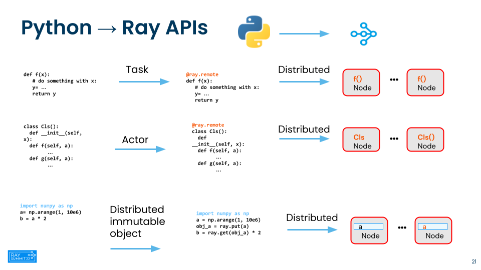
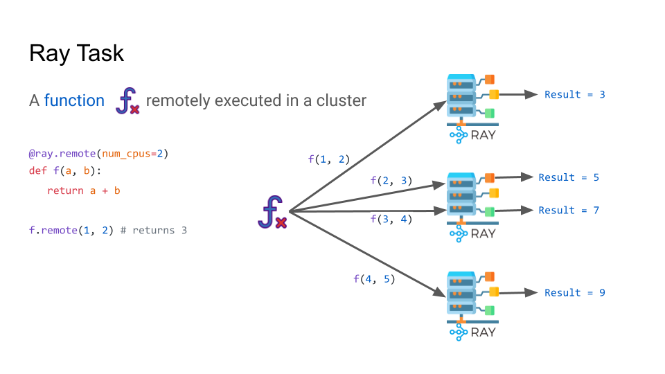
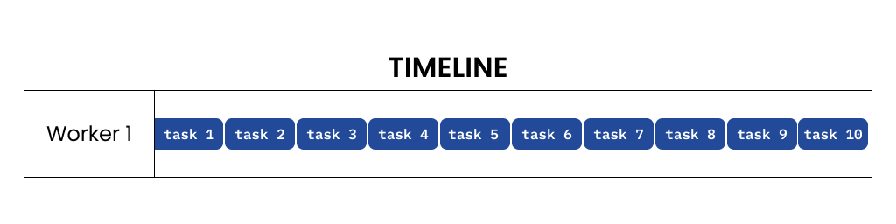
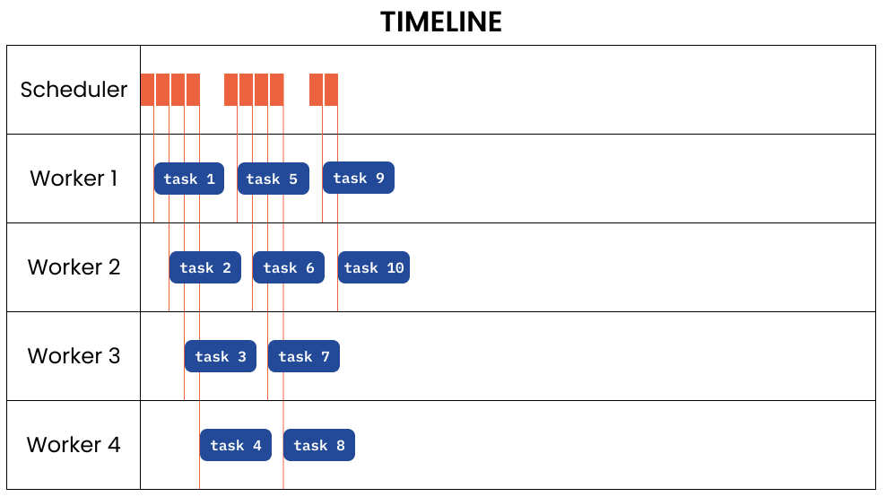

# Ray Core导览: 远程任务

## 介绍

Ray允许任意Python函数在单独的Python工作线程上异步执行。这些异步Ray函数称为“Task”。可以通过cpu、gpu和自定义资源来指定任务的资源需求。集群调度器使用这些资源请求在集群中分发任务，以便并行执行。





## 学习目标

在本教程中，你将学习:

- 远程任务并行模式

- 作为分布式任务的无状态远程函数

- 串行与并行执行

- 理解Ray task的概念

- 简单的API将现有的Python函数转换为Ray远程任务

- 通过示例分别比较串行与分布式Python函数和Ray任务

## 任务并行模式

Ray通过 `@ray.remote` 修饰函数，使其成为无状态任务，在集群中的Ray节点的工作器上调度。

它们将在集群上的何处执行(以及在哪个节点上由哪个工作进程执行)，您不必担心其细节。一切都已安排好了，所有的工作都由Ray完成。您只需将现有的Python函数转换为分布式无状态Ray任务：就这么简单!

### 串行与并行执行

作为常规Python函数的串行任务以顺序的方式执行，如下图所示。如果我启动十个任务，它们将一个接一个地在单个worker上运行。



与串行执行相比，Ray任务是并行执行的，调度在不同的工作器上。Raylet将根据调度策略调度这些任务。



让我们对比一些任务的串行运行和并行运行。为了说明，我们将使用以下任务:

- 生成斐波那契数列

- 用蒙特卡罗方法计算 $\pi$

- 转换和处理大型高分辨率图像

- 使用Ray Task进行批推理

但首先，让我们了解一些基本概念: 原始Python函数和修饰后的函数之间存在一些关键区别:

- 调用: 使用 `func_name()` 调用常规版本，而使用 `func_name.remote()` 调用远程Ray版本。所有Ray远程执行方法都是这个模式。

- 执行方式和返回值: Python 常规版本的函数同步执行并返回结果，而Ray任务 `func_name.remote()` 立即返回 `ObjectRef`，然后在远程工作进程的后台执行任务。通过在 `ObjectRef` 上调用 `ray.get(ObjectRef)` 来获得结果，这是一个阻塞函数。

让我们在本地机器上启动一个Ray集群。

``` python
import os
import time
import logging
import math
import random

from pathlib import Path
from typing import Tuple, List

import numpy as np
import pandas as pd
import pyarrow.parquet as pq
import tqdm
import ray

if ray.is_initialized:
    ray.shutdown()
ray.init(logging_level=logging.ERROR)
```

## 例1: 生成斐波那契数列

让我们定义两个函数:一个串行运行，另一个在Ray集群(本地或远程)上运行。这个例子是从我们的博客中借用和重构的:[用Ray编写你的第一个分布式Python应用程序](https://www.anyscale.com/blog/writing-your-first-distributed-python-application-with-ray)。(这是一个很好的教程，从为什么和何时使用Ray tasks和actors的概念开始。强烈推荐阅读!)

``` python
SEQUENCE_SIZE = 100000

# 本地执行的函数
def generate_fibonacci(sequence_size):
    fibonacci = []
    for i in range(0, sequence_size):
        if i < 2:
            fibonacci.append(i)
            continue
        fibonacci.append(fibonacci[i - 1] + fibonacci[i - 2])
    return len(fibonacci)

# 用于远程Ray task的函数
@ray.remote
def generate_fibonacci_distributed(sequence_size):
    return generate_fibonacci(sequence_size)

# 获取内核的数量
print(os.cpu_count()) # 16

# 单个进程中的普通Python
def run_local(sequence_size):
    results = [generate_fibonacci(sequence_size) for _ in range(os.cpu_count())]

# 分布在Ray集群上
def run_remote(sequence_size):
    results = ray.get([generate_fibonacci_distributed.remote(sequence_size) for _ in range(os.cpu_count())])
    return results

start = time.time()
run_local(SEQUENCE_SIZE)
end = time.time()

print(f"Local: {end - start}") # 4.63s

start = time.time()
run_remote(SEQUENCE_SIZE)
end = time.time()
print(f"Remote: {end - start}") # 2.55s
```

正如你所看到的，作为Ray Tasks运行时，我们只需添加一个Python装饰器  `Ray .remote` 就可以显著提升性能📈。

## 例2: 用蒙特卡罗方法计算 $\pi$

让我们用蒙特卡罗方法估计 $\pi$ 的值。我们随机抽取2x2平方内的点。我们可以使用以原点为中心的单位圆内包含的点的比例来估计圆的面积与正方形的面积之比。

假设我们知道真实的比率是π/4，我们可以将估算的比率乘以4来近似 $\pi$ 的值。我们在计算这个近似值时采样的点越多，我们就越接近 $\pi$ 的真实值和所需的小数点。

定义一个通常的函数来计算圆中的样本数。这是通过在 $(-1,1)$的统一值之间随机抽样 `num_samples` 个 $x, y$ 的来完成的。使用 `math.hypot`` 函数，我们计算d点是否落在圆内。

``` python
NUM_SAMPLING_TASKS = os.cpu_count()
NUM_SAMPLES_PER_TASK = 10_000_000
TOTAL_NUM_SAMPLES = NUM_SAMPLING_TASKS * NUM_SAMPLES_PER_TASK

def sampling_task(num_samples: int, task_id: int, verbose=True) -> int:
    num_inside = 0
    for i in range(num_samples):
        x, y = random.uniform(-1, 1), random.uniform(-1, 1)
        if math.hypot(x, y) <= 1:
            num_inside += 1
    if verbose:
        print(f"Task id: {task_id} | Samples in the circle: {num_inside}")
    return num_inside
```

定义一个函数，通过在一个推导式列表中启动 `NUM_SAMPLING_TASKS` 串行任务来串行地运行这个任务。

``` python
def run_serial(sample_size) -> List[int]:
    results = [sampling_task(sample_size, i) for i in range(NUM_SAMPLING_TASKS)]
    return results
```

通过远程Ray任务来运行，它调用我们的采样函数，但是因为它是用@ray装饰的。远程时，任务将在Ray集群上绑定到一个核心的工作进程上运行。

``` python
@ray.remote
def sample_task_distributed(sample_size, i) -> object:
    return sampling_task(sample_size, i)

def run_distributed(sample_size) -> List[int]:
    # 在一个推导式列表中启动Ray远程任务，每个任务立即返回一个未来的ObjectRef
    # 使用ray.get获取计算值；这将阻塞直到ObjectRef被解析或它的值被具体化。
    results = ray.get([sample_task_distributed.remote(sample_size, i) for i in range(NUM_SAMPLING_TASKS)])
    return results
```

定义一个函数，通过从采样任务中获取圆内的所有样本数来估计 $\pi$ 的值。

``` python
def calculate_pi(results: List[int]) -> float:
    return 4 * sum(results) / TOTAL_NUM_SAMPLES

# 串行计算π
start = time.time()
results = run_serial(NUM_SAMPLES_PER_TASK)
pi = calculate_pi(results)
end = time.time()
print(f"Estimated value of pi is: {pi:5f}")
print(f"Serial execution time: {end - start:5f}") # 76.42

# 分布式计算π
start = time.time()
results = run_distributed(NUM_SAMPLES_PER_TASK)
pi = calculate_pi(results)
end = time.time()
print(f"Estimated value of pi is: {pi:5f}")
print(f"Distributed execution time: {end - start:5f}") # 13.73
```

在Ray中，我们看到速度加快了~6X。

## 例3: 如何使用Ray分布式任务进行图像变换和计算

对于本例，我们将通过变换和计算大型高分辨率图像来模拟计算密集型任务。这些任务在训练DNN图像分类中并不少见。

PyTorch `torchvision。transforms` API提供了许多变换API。我们将在这里使用几个，以及一些numpy和torch.tensor的操作。我们的任务将执行以下计算密集型变换：

1. 使用PIL api来模糊图像；

2. 使用pytorch的 `TrivalAugmentWide`；

3. 将图像转换为numpy array和pytorch tensor，并执行numpy和torch张量操作，例如转置、乘法；

4. 指数幂和与张量相乘；

我们的目标是比较串行运行这些任务和作为一个Ray任务分布式运行这些任务的执行时间。