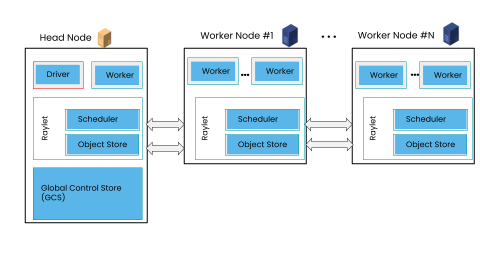
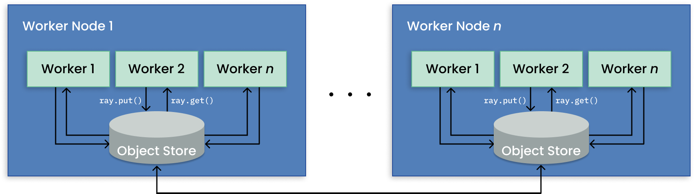

# A Guided Tour of Ray Core: Remote Objects

## 总览

在Ray中，task和actor在对象上创建和计算。我们将这些对象称为远程对象，因为它们可以存储在Ray集群中的任何位置，并且我们使用对象引用来引用它们。远程对象缓存在Ray的分布式共享内存对象存储中，并且集群中的每个节点都有一个对象存储。在集群设置中，远程对象可以驻留在一个或多个节点上，与谁持有对象引用无关。总的来说，这些单独的对象存储构成了一个跨Ray集群的共享对象存储，如下图所示。



对象是不可变的，可以从集群上的任何地方访问，因为它们存储在集群共享内存中。对象指针本质上是一个指针或一个唯一的ID，可以用来引用一个远程对象，而不需要看到它的值。如果你熟悉Python、Java或Scala中的期货，那么Ray对象参考在概念上是相似的。

通常，小对象存储在其所有者的进程内存储区(<=100KB)中，而大对象存储在分布式对象存储区中。这个决定是为了减少每个对象的内存占用和解析时间。请注意，在后一种情况下，占位符对象存储在进程内存储区中，以指示该对象已被提升到共享内存。

在共享内存中没有空间的情况下，对象会溢出到磁盘。但这里的要点是，共享内存允许对同一工作节点上的进程进行零拷贝访问。

## 学习目标

在本教程中，您将学习:

- Ray Futures

- Ray 分布式对象存储

- 如何从分布式共享对象存储中存储和获取对象：`ray.get` 和 `ray.put`

- 如何使用Ray任务和对象存储来进行大规模的批推理

## 对象引用作为future

首先启动Ray…

``` python
import logging
import random

from typing import Tuple

import numpy as np
import pandas as pd
import pyarrow.parquet as pq
import torch
import ray
```

## 例1：远程对象

首先，我们将创建一些python对象，并使用Ray Core API将它们放入共享内存中。

- `ray.put()` 将一个对象放入内存中的对象存储区并返回它的RefObjectID。使用这个RefObjectID将对象传递给任何远程task或actor方法调用

- `ray.get()` 从对象存储区获取远程对象或远程对象列表中的值



创建一个函数来返回一个随机张量。我们将使用这个张量存储在我们的对象存储库中，并在稍后检索它以进行处理。

``` python
def create_rand_tensor(size: Tuple[int, int]) -> torch.tensor:
    return torch.randn(size=(size), dtype=torch.float)

@ray.remote
def transform_rand_tensor(tensor: torch.tensor) -> torch.tensor:
    return torch.mul(tensor, random.randint(2, 10))
```

创建随机张量并将它们存储在对象存储库中：

1. 创建一个随机张量

2. 把它放到对象存储中

3. 推导式列表返回ObjectRefIDs列表

``` python
torch.manual_seed(42)

tensor_list_obj_ref = [ray.put(create_rand_tensor(((i+1)*25, 50))) for i in range(100)]
print(tensor_list_obj_ref[:2], len(tensor_list_obj_ref))
```

获取此对象引用的值。

通过直接从所有者的进程内存储区复制小对象来解析它们。例如，如果所有者调用ray。获取时，系统查找并反序列化本地进程内存储的值。对于大于100KB的大对象，它们将存储在分布式对象存储中。

``` python
# 因为我们得到了一个ObjectRefIDs列表，从中索引到张量的第一个值
val = ray.get(tensor_list_obj_ref[0])
print(val.size(), val)

# 或者，您可以获取多个对象引用的所有值。
results = ray.get(tensor_list_obj_ref)
print(results[:1], results[:1][0].size())
```

让我们转换存储在对象存储库中的张量，将转换后的张量放入对象存储库(射线远程任务将隐式地将其存储为返回值)，然后获取值。

使用远程任务转换对象存储中的每个张量。

``` python
transformed_object_list = [transform_rand_tensor.remote(t_obj_ref) for t_obj_ref in tensor_list_obj_ref]
print(transformed_object_list[:2])

# 获取所有变换后的张量
transformed_tensor_values = ray.get(transformed_object_list)
print(transformed_tensor_values[:2])
```

Ray的对象存储是一个跨Ray集群的共享内存存储。每个Ray节点上的工作器都有自己的对象存储，他们可以使用简单的Ray api `ray.put` 和 `ray.get`，来插入值和获取由Ray任务或Actor方法创建的Ray对象的值。总的来说，每个节点的这些单独的对象存储构成了一个共享的分布式对象存储。

在上面的练习中，我们创建了随机张量，将它们插入到我们的对象存储中，通过迭代每个ObjectRefID对它们进行转换，将这个ObjectRefID发送给一个Ray任务，然后获取每个Ray远程任务返回的转换张量。

### 传递对象

Ray对象引用可以在Ray应用程序中自由传递。这意味着它们可以作为参数传递给task、actor的方法，甚至存储在其他对象中。通过分布式引用计数跟踪对象，一旦删除对对象的所有引用，就会自动释放对象的数据。

``` python
# 定义任务
@ray.remote
def echo(x):
    print(f"current value of argument x: {x}")

# 定义一些变量
x = list(range(10))
obj_ref_x = ray.put(x)
y = 25
```

#### 按值传递

将对象作为顶级参数发送给任务。对象将自动取消引用，因此任务只能看到它的值。

``` python
# 作为值参数传递y
echo.remote(y)

# 传递一个对象引用
# 注意，echo函数对它进行了区分
echo.remote(obj_ref_x)
```

#### 按引用传递

当参数在Python列表中传递或作为任何其他数据结构传递时，对象ref将被保留，这意味着它不会被取消引用。对象数据通过引用传递时不会传输到工作器，直到在引用上调用 `ray.get()`。

您可以通过两种方式传递引用:

1. 作为字典 `.remote({"obj": obj_ref_x})`

2. 作为列表 `.remote([obj_ref_x])`

``` python
x = list(range(20))
obj_ref_x = ray.put(x)

echo.remote({"obj": obj_ref_x})
echo.remote([obj_ref_x])
```

### 长时间运行的任务呢?

有时，您可能会有长时间运行的任务，由于某些问题超过了预期时间，可能在访问对象存储中的变量时受阻。如何退出或终止它？使用timeout。

现在让我们设置一个timeout，以便在尝试访问阻塞时间过长的远程对象时提前返回。您可以控制等待任务完成的时间。

``` python
import time
from ray.exceptions import GetTimeoutError

@ray.remote
def long_running_task():
    time.sleep(10)
    return 42

obj_ref = long_running_task.remote()
try:
    ray.get(obj_ref, timeout=6)
except GetTimeoutError:
    print("`get` timed out")
```

## 