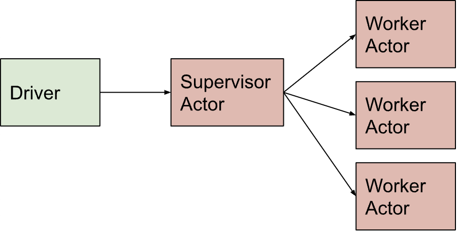

# Ray Core: Remote Classes as Actors - Tree of Actors

## 概述

Ray为任务和角色提供了无数的设计模式。这些模式允许您编写分布式应用程序。在本教程中，我们将探索一种设计模式，它通常用于Ray库来扩展工作负载。

## Tree of Actors 模式

这种模式主要用于Ray库 Ray Tune, Ray Train和RLlib，以并行或进行分布式训练HPO。

在树模式中，作为Ray actor(或者在某些情况下也是Ray任务)的集合由主管actor管理。例如，您希望同时训练多个模型，每个模型都使用不同的ML算法，同时能够在训练期间检查其状态。作为一种快速检查简单基线模型的方法，该模式可以帮助机器学习工程师快速构建一组基线模型进行比较。



这种模式有助于相同数据不同功能/模型(SDDF)的缩放模式。在AutoML场景中很流行，在这种场景中，您可能希望同时使用相同的数据集训练不同的模型，并使用各自的算法。

## 学习目标

在本教程中，我们重新审视Ray actor，深入研究其对于缩放模式的使用，并了解:

- Ray原生库中用于编写分布式actor的常见Ray Actors模式

  - Tree of Actors

  - Same Data Different Functions (SDDF)

- 如何使用actor和actor池进行批量推理

让我们实现一个简单的示例来说明这个模式。

## 例1：主管和工人actor模式

问题：我们想在相同的数据集上训练多个小模型，比如线性回归，每个模型都有各自的机器学习算法，以创建一组基线模型进行比较。在我们的案例中，我们使用scikit-learn加利福尼亚房价数据集，并使用类型线性回归模型。我们将训练不同的线性回归模型:决策树、随机森林和xgboost回归器。每个模型都是基于均方误差(MSE)进行训练和评估的。

``` python
import logging
import time
import ray
import random
from random import randint
import numpy as np
import pandas as pd
import pyarrow.parquet as pq
from pprint import pprint

import ray
from ray.util.actor_pool import ActorPool

if ray.is_initialized:
    ray.shutdown()
ray.init(logging_level=logging.ERROR)
```

通过通用模型工厂生成三种不同的线性回归算法——随机森林、决策树和xgboost——并在相同的Scikit学习数据集上进行训练加州房价每个训练模型返回其MSE分数。

在训练过程中，每个模型都可以处于某个的状态。最后的状态是DONE。

``` python
from model_helper_utils import RFRActor
from model_helper_utils import DTActor
from model_helper_utils import XGBoostActor
from model_helper_utils import RANDOM_FOREST_CONFIGS, DECISION_TREE_CONFIGS, XGBOOST_CONFIGS

class ModelFactory:
    MODEL_TYPES = ['random_forest', 'decision_tree', 'xgboost']
    
    @staticmethod
    def create_model(model_name: str) -> ray.actor.ActorHandle:
        if model_name == 'random_forest':
            configs = RANDOM_FOREST_CONFIGS
            return RFRActor.remote(configs)
        elif model_name == 'decision_tree':
            configs = DECISION_TREE_CONFIGS
            return DTActor.remote(configs)
        elif model_name == 'xgboost':
            configs = XGBOOST_CONFIGS
            return XGBoostActor.remote(configs)
        else:
            raise ValueError(f"{model_name} is not a valid model type")
```

创建一个Actor实例作为管理者，此actor创建三个工作actor，每个actor都有自己各自的训练模型ML算法和训练功能。

``` python
@ray.remote
class Supervisor:
    def __init__(self):
        self.worker_models = [ModelFactory.create_model(name) for name in ModelFactory.MODEL_TYPES]
        
    def work(self):
        results = [worker_model.train_and_evaluate_model.remote() for worker_model in self.worker_models]
        return ray.get(results)

supervisor = Supervisor.remote()
results = supervisor.work.remote()
values = ray.get(results)

while True:
    states = []
    for value in values:
        states.append(value['state'])
    result = all('DONE' == e for e in states)
    if result:
        break

from operator import itemgetter
sorted_by_mse = sorted(values, key=itemgetter('mse'))
print(f"\nResults from three training models sorted by MSE ascending order:")
pprint(sorted_by_mse)
```

综上所述，我们实现了一个树actor设计模式，其中一个supervisor启动了worker模型。在我们的例子中，每个模型都是在相同数据上训练的单独的线性回归模型。这种树actor模式有助于相同数据不同功能(SDDF)缩放模式，这是一种常见的机器学习工作负载。

对于模块化，我们使用model_helper_utils，其中实现了所有与模型相关的实用程序代码。从使用相同数据集并行训练的所有三个线性回归模型来看，XGBoost似乎具有最佳的MSE结果。这为我们提供了一组模型的初始基线，以进一步实验不同的超参数优化。为此，我将转向Ray Train和Ray Tune，它们是Ray AIR的一部分。

## 示例2：基于actor的批推理

在Ray remote object的教程中，我们介绍了一个并行批处理推理的用例。简而言之，我们使用了不同数据相同功能(DDSF)模式。这里我们将使用相同的模式，但使用Ray Actors和ActorPool，它们是基于状态的首选方法来进行批处理推理。基本上，除了一些修改外，元素保持不变。

- 输入数据集：这是用于生成预测的大量观察数据集。数据通常存储在外部存储系统中，如S3、HDFS或数据库。

- ML模型：这是一个经过训练的ML模型，通常也存储在外部存储系统或模型存储中。

- 预测：这些是将ML模型应用于观测时的输出。通常，预测结果通常被写回存储系统。与进行预测的任务不同，我们使用了一组actor。

为了本教程的目的，我们做出以下规定：

- 创建一个虚拟模型，返回一些虚假的预测

- 使用真实的纽约市出租车数据，为批推理提供大数据集

- 创建一个actor池，并将每个分片提交到池中

- 返回预测结果，而不是将其写回磁盘

``` python
NUM_ACTORS = 6
NUM_SHARD_FILES = 12

def load_trained_model():
    def model(batch: pd.DataFrame) -> pd.DataFrame:
        model.payload = np.arange(10, 10_000, dtype=float)
        model.cls = 'regression'
        predict = batch['passenger_count'] >= 2
        return pd.DataFrame({'score': predict})
    return model

# 创建一个Ray actor来存储模型引用并进行预测
@ray.remote
class NYCBatchPredictor:
    def __init__(self, model):
        self.model = model

    def predict(self, shard_path):
        df = pq.read_table(shard_path).to_pandas()
        result = self.model(df)
        return result

model = load_trained_model()
model_ref = ray.put(model)

input_shard_files = [
    f"s3://anonymous@air-example-data/ursa-labs-taxi-data/downsampled_2009_full_year_data.parquet"
    f"/fe41422b01c04169af2a65a83b753e0f_{i:06d}.parquet"
    for i in range(NUM_SHARD_FILES) ]

# 创建池
actors = [NYCBatchPredictor.remote(model_ref) for _ in range(NUM_ACTORS)]
actors_pool = ActorPool(actors)

# 将每个分片提交到池中
for shard_path in input_shard_files:
    actors_pool.submit(lambda actor, shard: actor.predict.remote(shard), shard_path)

while actors_pool.has_next():
    r = actors_pool.get_next()
    print(f"Predictions dataframe size: {len(r)} | Total score for tips: {r['score'].sum()}")
```

我们上面演示的是一个Actor树设计模式，在Ray中通常用于编写分布式应用程序。特别是，Ray的原生库(如Train、Tune、Serve和RLib)和Ray AIR的组件使用它进行分布式训练和调优试验。

此外，我们使用基于actor的预测器模型函数实现了DDSF缩放设计模式，使用ActorPool实用程序类代替task。

如果模型大小很大，基于任务的批推理的开销会很大，因为它必须从驱动程序的存储中获取模型。我们可以通过使用Ray actor来优化它，它将只获取一次模型，并将其用于分配给池中相同actor的所有预测。
