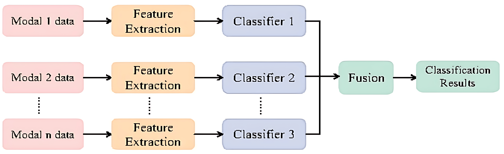

# Emotion Recognition by Video: A Review

## Motivation

情绪识别是情感计算的重要分支，在人机交互和智能医疗等领域有着广泛的应用。该领域存在着大量的工作，但是缺乏全面的文献综述介绍视频情绪识别的最新研究。

## Contribution

本文统计了2015 - 2023年视频情绪识别的相关工作，主要包括以下内容：

1. 两种典型的情绪建模方法；

2. 常用的视频情绪识别数据集，包括单模态数据集和多模态数据集；

3. 单模态和多模态视频情绪识别算法，以及它们的优缺点和不同方法之间的对比；

4. 该领域的主要困难点和未来的方向；

## Modeling Approach to Emotion

在情绪识别任务中，情绪建模方法主要有两种：

1. 分类情绪建模方法（categorical emotion states, CES）

   这种方法将情绪分为离散的类别，通常是通过给定的一个固定的情绪列表进行选择，如愤怒、厌恶、恐惧、快乐、悲伤、惊讶。这种方法的优点是简单易懂，特别是对于用户，缺点是无法充分反映情绪的复杂性和细微性。

2. 维度情绪建模方法（dimensional emotion space, DES）

   这种方法使用N维笛卡尔坐标系建模情绪空间，每个维度表示不同的情绪评价指标，具体的情绪则根据每个评价指标的大小表示为该欧式空间中的一个点。例如使用valence和arousal两个指标量化情绪，valence表示情绪的正负，“高兴”对应正的valence，“悲伤”对应负的valence，arousal表示情绪的剧烈程度，“激动”对应正的arousal，“冷静”对应负的arousal。

   这种方法理论上可以表达所有的情绪，但是缺点是用户难以理解和使用。

## Dataset

数据集根据包含的信息模态可以分为两类，单模态数据和多模态数据：

1. 单模态数据，所有样本都是视频模态。

   - MMI Facial Expression Database: 包含61个成年人展示各种基本情绪的视频以及25个成年人对视频的反映。总共有多于2900个视频，视频包含正面和侧面，包含6种不同的情绪（愤怒、厌恶、恐惧、高兴、悲伤、惊讶）。

   - AFEW Database: 包含1809个户外的情绪视频，覆盖6种基本情绪（惊讶、怨恨、恐惧、快乐、悲伤、愤怒）。

2. 多模态数据，除了视频之外，包含其他模态的信息，如红外图、文本、音频等。

   - IEMOCAP Database: 包含12小时的，由视频、音频、文本组成的视听数据，视频被按照句子切分，每个句子至少包含快乐、悲伤、愤怒、惊讶、恐惧等情绪之一。

   - eNTERFACE'05 Database: 包含语音和面部表情，共1287个来自42个测试者的视频。测试者听六个简短的英文文本，并对短文本中描述的特定情感情况做出反应。每个音频和视频文件都标有一个情绪，总共包含六个基本情绪类别：快乐、悲伤、愤怒、惊讶、恐惧和厌恶。

数据集还可以根据情绪的产生方式分为自发情绪数据集和诱导情绪数据集：

1. 自发情绪数据集，情绪的产生是自发产生的，而不是实验要求作出的。

2. 诱导情绪数据集，情绪是在实验条件下要求作出的。

以下其他主流数据集的信息。

## Video Emotion Recognition

和数据集分类方式类似，视频情绪识别方法也可以分为单模态识别方法和多模态识别方法。

1. 单模态情绪识别方法

   - 基于面部表情的识别方法

     基于面部表情的单模态情绪识别算法主要利用人脸图像中表现出的表情特征来识别和分类情绪。这种方法的优点在于数据易于收集，不需要很多数据预处理，并允许快速预测。然而，这种方法的可靠性较低，难以区分细微的情绪变化。

   - 基于姿态动作的识别方法

     基于姿态动作的单模态情绪识别算法是一种新兴的研究领域，该方法基于视频中角色的运动特征预测视频中的情绪。许多心理学研究发现，人类通过身体运动可以识别各种情绪状态。通常，人们通过习惯性的身体运动表达情绪，如摇动腿、肩膀上下移动等。此外，由于身体运动通常是一个人的无意识移动，因此通常不存在欺骗。这种方法的优点在于数据易于收集，不同情绪间姿态存在显著的差别。然而，常规动作如走路、静坐时难以区分情绪，且表达情绪的动作会受地域和文化影响。

2. 多模态情绪识别方法

   多模态情绪识别算法通常由三个主要步骤组成：特征提取、多模态融合和情绪识别。如何融合多模态信息是算法的关键和难点，根据多模态融合的方式，多模态识别算法可分为如下几种：

   - 特征级融合方法

     特征级融合方法（Feature-level fusion，又称为早期融合）是一种利用特征拼接作为融合方法的技术。具体实现过程如下：首先从各种模态中提取各种模态数据，构建相应的模态特征，然后将它们拼接为一个整合各种模态特征的特征。特征级融合方法可以提高特征丰富性，提高识别性能，但它不考虑特征之间的差异，难以建模不同模态特征之间的复杂关系，无法处理模态信息缺失的情况。

     

   - 决策级融合方法

     决策级融合方法，也称为晚期融合（Late Fusion），是一种通过特定代数方法融合单模态结果的技术。它通过将不同模态的信号输入相应的算法进行特征提取，然后使用相应的分类器进行情感识别，并使用某种决策规则融合每种模态的预测结果得分，以获得最终的情感识别结果。决策级融合优点是易于实现，具有更大的灵活性和更好的容错能力，但它无法捕捉到不同模态之间的互补性和相关性。

     

   - 基于transformer/attention的融合方法

     这种方法通过自注意力机制（attention mechanism）自适应地确定从数据中提取的有用信息，从而生成具有较高鲁棒性和有效性的融合策略，可以建模不同模态之间的复杂关系，利用它们之间的互补性和相关性，具有更好的识别性能。缺点是带来了更复杂的计算，需要更多的训练数据。
     
下图为不同种类的方法所占比例随时间的变化趋势，可以看出基于transformer/attention的多模态融合的识别方法逐渐成为了主流的算法。

## Evaluation Criteria

1. 准确率（Accuracy），用于离散情绪预测

   $Accuracy = \frac{TP+TN}{TP+TN+FP+FN}$

2. F1分数，用于离散情绪预测

   $F1 = \frac{2 * Precision * Recall}{Precision + Recall}$

3. 一致性相关系数（Concordance Correlation Coefficient，CCC），用于连续情绪预测

   $CCC = \frac{2*\sigma_{12}}{\sigma_1^2+\sigma_2^2-(\mu_1-\mu_2)^2}$

下表列出了多个算法的相关信息以及评价指标。

## Challenges

1. 数据问题

   - 数据不平衡：现有数据集中的情感识别数据存在不平衡问题，可能导致训练模型的偏差。
   
   - 数据量不足：现有数据集的数量有限，尤其是对于多模态数据，这可能导致模型训练效果欠佳。
   
   - 数据描述不准确：一个视频数据在标注时只会标注一种情绪，而现实情况下一个视频往往包含多个复杂的情绪。
   
   - 情绪建模方法不完善：现有两种情绪的建模方法均存在明显缺陷。

2. 算法问题

   - 模型可解释性研究不足：需要进一步研究视频情感识别模型的决策依据、决策原因以及预测结果的可信度。
   
   - 模型可靠性需要提高：现有的情感识别模型在实际应用中可能存在误差较大的问题。
   
   - 模型的泛化能力差：现有的模型很难在不同分布的数据上准确地识别情绪。

   - 多模态模型的计算复杂度高：多模态特征的引入将使学习过程更加复杂，带来了多维问题和计算时间的增加。

   - 多模态研究是不充分的：一方面，当前多模态融合方法无法有效解决模态冲突问题，当两个或多个模态不一致时，现有模型将发生冲突，导致结果不准确；另一方面，多模态情感识别数据库样本丰富度、数量不足等问题难以支持大规模深度学习。

## Future

1. 数据方面

   - 更真实的数据：大多数现有数据集是电影和电视节目的剪辑，或记录在实验室演绎下，不包括复杂的现实世界条件，而在实际应用中，需要考虑更多的因素。因此，需要构建表现实际世界的数据集。

   - 更完善的多模态数据：与单模态情感数据库相比，公开可用的多模态数据很少，并且有一些缺失和不完整的模态。此外，大多数现有的多模态情感数据库都是基于西方国家的语言记录的，没有考虑地理种族差异。因此，构建一个包含更多模态信息、语言多样化和公开可用的数据，有利于促进多模态情感识别研究领域的多模态情感识别研究。

   - 短视频数据建设：由于互联网技术，短视频发展迅速，大多数人都会浏览短视频。因此，建立一个全面的短视频数据集也是必要的和重要的。

2. 算法方面

   - 更丰富的模态信息：目前主流的多模态情感识别研究都是基于语音和人脸两种最重要的模态，缺乏对其他模态信号的研究，因此对更多模态信息的综合利用也是未来情感识别的一个重要方向，添加更多模态可以更准确地分析人类的情绪状态。

   - 更有效的信息融合方法：多模态信息在表达信息方面具有一定的互补性和不同的重要性。如何利用多模态特征信息之间的互补性和相关性？如果采用有效的融合方法融合多模态特征，可以获得更好的准确性和鲁棒性。

   - 更轻量的模型：精度和速度之间的权衡需要进一步研究，因此在保持精度不下降的同时，轻量的模态融合方法是未来发展的一个重要方向。

   - 更可靠的模型：提高模型可解释性和可靠性，以更好地了解情感识别模型的原理和性能，应对不同的数据分布和复杂的现实场景。