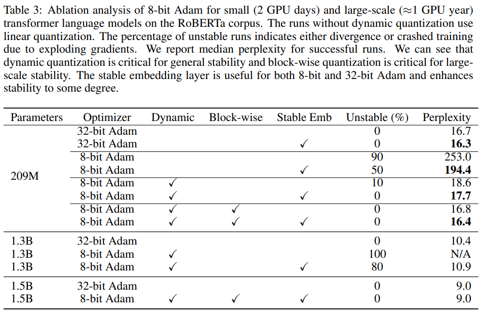

# 8-Bit Optimizers via Block-wise Quantization

## Motivation

训练大模型需要大量的内存，其中优化器占用了很大的比例，而如何减少优化器的内存占用还没有有效的解决方案。已有工作者在16位优化器上进行尝试，但8位优化器仍没有成功的工作。同时，8位优化器存在如下三个挑战：

1. 量化准确率：维持高精度，必须使用非线性量化，减少出现频率高的小幅度值和罕见的大幅度值。

2. 计算效率：引入非线性量化导致训练速度下降。

3. 大模型稳定性：为了维持稳定的训练，量化方法不仅需要有较低的平均量化误差，同时最差情况下也要有较好的表现。

## Contribution

- 提出基于块的量化方法：将张量分块，并对每块进行单独量化。该方法存在以下优点：

  - 因为异常值被隔离在特定的块中，减弱异常值的影响，提升性能和稳定性。

  - 不同的块可以并行量化，提升速度。

- 结合两个新的方法提升稳定性：

  - 动态量化（dynamic quantization），基于动态树量化针对无符号数据的一种拓展。

  - 稳定嵌入层，标准嵌入层的拓展，通过归一化高度非均匀分布以支持更好的量化，避免极端梯度。

- 该8位优化器和32位优化器具有相同的表现，内存占用更少。

## Background

### Stateful Optimizers

对于32位优化器，Momentum和Adam每个参数分别消耗4和8个字节

### Non-Linear Quantization

量化 （或int8,float16,float32）是一个映射，将k位整数映射为一个实数，$ Q^{map}: [0, 2^k-1] \rightarrow R $.

将一个数据类型 $Q^{map}_1$ （如fp32）量化为另一个数据类型 $Q^{map}_2$（如int8），需要以下三个步骤：

1. 将 $Q^{map}_1$ 的值域通过正则化常数 $N$ 归一化到 $Q^{map}_2$的值域范围；

2. 对于每一个 $Q^{map}_1(i) / N$，找到 $Q^{map}_2$ 的值域中最接近的值 $Q^{map}_2(j_i) $.

3. 反量化则是将 $Q^{map}_2(j_i)$ 乘以 $N$。

### Dynamic Tree Quantization

动态数量化是一种量化方法，可以同时对大幅度值和小幅度值产生较小的量化误差。不同于int8、fp16、fp32等数据类型，动态树量化使用的数据类型具有动态的指数位和小数位，如下图所示。该数据由4部分组成：

1. 符号位，数据的第一位。

2. 指数位，由符号位后连续的0表示，连续 $i$ 个 $0$ 表示指数为为 $1e-i$.

3. 分隔位，指数位后第一个 $1$表示，用于分隔指数位和小数位。

4. 小数位，分隔位后续均为小数位，采用线性量化，假设有 $j$ 位，小数位从小到大$[0, 1, ..., 2^j-1]$对应了小数 $[0, 1 / (2^j-1), ..., 1]$.

所以其能表示的范围为 $[-1, 1]$.

## 8-Bit Optimizers

提出的8位优化器，包括三个组成：基于块的量化方法、动态量化、稳定嵌入层。更新优化器状态时需要将8位优化器的状态量反量化为32位，然后再进行更新，最后将32位优化器的状态量量化为8位。

### Blockwise Quantization

对于一个张量T，将其视为一维向量，以B的大小将其分成一个个小块。分别在每个小块上计算最大值（绝对值）进行归一化，然后进行量化。分块量化有以下两点好处：

1. 每个块计算独立，方便并行。

2. 对输入张量中的异常值进行隔离，减少量化误差。且对最大值没有量化误差。

### Bynamic Quantization

由于Adam优化器中第二状态值严格为正，且实验观察其在训练过程中的变化范围约3-5个数量级，因此对第二状态值的量化，去掉符号位并使用固定的小数位。

### Stable Embedding Layer

使用Xavier uniform初始化对嵌入层进行初始化，然后使用layer norm归一化，最后和位置编码相加。嵌入层使用32位优化器优化，这对于维持训练稳定至关重要。(一个batch内不同token出现的频率不同，出现频率很高的token可能累计很大的梯度。)

## Experiments

提出的方法可以维持32位优化器的表现，同时降低现存占用和训练时间。

消融实验结果如下所示，所使用的三个技术对于8bit训练的精度和稳定性至关重要：

敏感度分析，不同的超参数下，8bit训练结果变化趋势与32bit训练变化类似。

