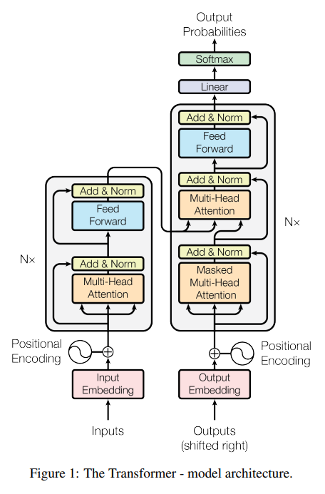
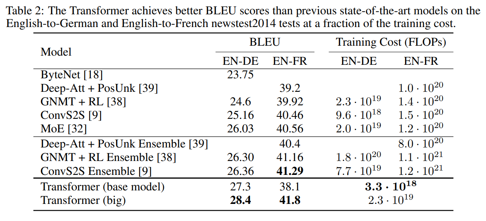

# Attention Is All You Need

## Motivation

RNN是序列建模中的主流和SOTA，RNN的计算方式导致它的计算效率低，无法处理长序列。

注意力机制已经成为各种任务中引人注目的序列建模的组成部分，允许在不考虑输入或输出的长度的情况下对依赖关系进行建模。

## Contribution

提出第一个完全依赖自注意力机制的转录模型，Transformer。

## Transformer

Transformer和多数转录模型类似，由编码器-解码器结构组成。编码器将一个符号序列 $(x_1, ..., x_n)$ 映射为一个连续表征序列 $(z_1,...,z_n)$ 。给定z，解码器通过自回归的方式生成输出序列 $(y_1,...,y_m)$。模型结构如下图所示。

编码器由N个相同的网络层组成，每个网络层包含两个子层，第一个子层为多头自注意力层，第二个子层为全连接前馈层。每个子层都使用了残差连接，然后是layer norm，即 $LayerNorm(x + Sublayer(x))$，Sublayer可以是多头自注意力层或全连接前馈网络。为了方便使用残差连接，网络中所有子层以及嵌入层的输出维度均为 $d_{model}=512$。

解码器同样由N个相同的网络层，每个网络层包含三个子层，第一个子层掩为掩码多头自注意力层，确保自回归输出中，位置i的预测只能依赖于位置小于i的已知输出。第二个子层为多头自注意力层，建模输出和编码器输出之间的依赖关系。最后一个子层为全连接前馈层。和编码器类似，每个子层也使用了残差连接和layer norm。

### Attention

注意力机制可以描述为将查询（query）和一组键值对（key-value）映射到输出，其中查询（query）、键（key）、值（value）和输出都是向量。输出是作为值（value）的加权和计算的，其中分配给每个值（value）的权重是通过查询（query）与相应键（key）计算的。多头自注意力层包含两部分：缩放点积注意力和多头注意力。

- 缩放点积注意力

  缩放点积注意力的输入为查询（query）、键（key）、值（value），查询和键为维度 $d_k$的向量，值为维度 $d_v$ 的向量。我们首先计算查询和所有键的点积，除以 $\sqrt d_k$，最后通过softmax计算值的权重。

  实际计算时是多个查询一起计算，查询、键、值是以矩阵的形式参与计算，如矩阵Q、K、V。缩放点积自注意力的计算为：$Attention(Q,K,V) = softmax(\frac{QK^T}{\sqrt d_k}) V$

- 多头注意力

  作者发现，使用$d_{model}$维度的向量计算一个缩放点积注意力，效果上不如将$d_{model}$维度的向量投影h次，计算h次缩放点积注意力的效果。

  多头注意力使得模型可以同时关注来自不同表示子空间的信息。公式如下：

  $$
  \begin{align*}
  MuiltHead(Q,K,V) & = Concat(head_1,...,head_h)W^O \\
  where\ head_i& = Attention(QW^Q_i,KW^K_i,VW^V_i)
  \end{align*}
  $$

  其中投影矩阵 $W^Q_i \in R^{d_{model} \times d_k},W^K_i \in R^{d_{model} \times d_k},W^V_i \in R^{d_{model} \times d_v},W^O \in R^{hd_v \times d_{model}}$。

在编码器第一个多头自注意力子层中，查询、键、值向量均来自上一个编码层输出。

在解码器第一个掩码多头自注意力子层中，为了防止反向的信息传递，softmax的权重中不合理的权重会被屏蔽（设为 $-\infin$）。

在解码器第二个多头自注意力子层中，查询向量（query）来自上一个解码层，键值向量则来自编码器输出，这使得解码器中的每个位置都参与解码计算。

## Feed-Forward Layers

编码器和解码器中的全连接前馈层，由两层全连接层和一层ReLU激活层组成。

$$ FFN(x) = max(0, x W_1 + b_1)W_2 + b_2 $$

其中 $W_1 \in R^{d_{model} \times 4d_{model}}, W_b \in R^{4d_{model} \times d_{model}}$.

## Embeddings and Softmax

模型中，编码器和解码器的嵌入层以及最后分类头softmax前的线性变化的参数共享。

## Positional Encoding

自注意力机制的计算中，不包含序列的顺序信息，因此需要注入位置信息（相对或绝对）。实现的方式是将位置编码和输入嵌入（编码器和解码器）进行求和。位置编码（向量）的维度和嵌入的维度相同，均为 $d_{model}$。Transformer采用了sin和cos函数位置编码，具体如下：

$$ PE(pos, 2i) = sin(pos/10000^{2i/d_{model}}) $$

$$ PE(pos, 2i+1) = cos(pos/10000^{2i/d_{model}}) $$

其中pos为序列中的位置，i为维度。作者实验对比了可学习的位置编码和上述位置编码，实验结果没有明显差别，而上述编码没有序列长度限制。

## Experiment

部分实验结果如下：

