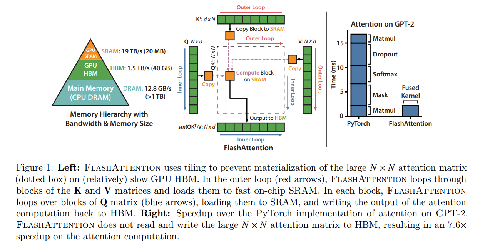
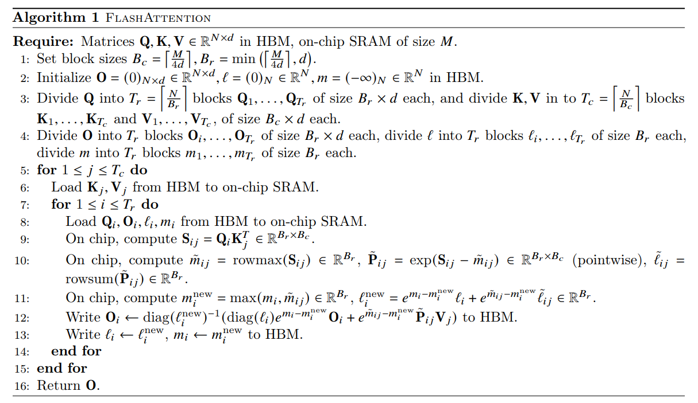
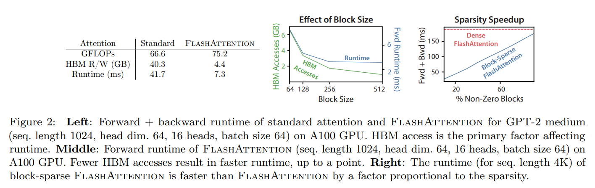

# FlashAttention: Fast and Memory-Efficient Exact Attention with IO-Awareness

## Motivation
Attention计算需要大量时间和内存，时间和内存复杂度与序列长度呈二次关系。近似attention方法通过牺牲模型表型以减少计算复杂度从而解决上述问题，但是通常无法减少真正的执行时间。这些方法仅考虑了FLOP却忽略了内存访问的开销。而attention的速度主要受内存IO限制，而不是计算限制。

Flash attention正是考虑不同内存的读写速率设计的attention算法，具有更快的执行速度和更小的内存占用。

## Contribution
* 提出flash attention算法，具有更快的计算速度和内存占用，因而可以实现更快的模型训练和推理以及更大输入序列长度，进而提升模型的表现；
* 基于flash attention改进的稀疏注意力，可以进一步提升速度和节省内存；

## Background
* GPU Memory Hierarchy

    GPU内存结构包含不同形式的内存，这些内存具有不同的大小和速度，如图1左图所示。
    

* Execution Model

    GPU中执行一个操作需要大量线程，需要将输入从HBM加载到寄存器和SRAM，执行计算，再将输出写入HBM

* Naive Attention Implementation

    给定输入序列 $Q,K,V\in R^{N\times d}$，其中$N$为序列长度，$d$为特征长度，attention的输出 $O\in R^{N \times d}$ 通过下式计算：
    
    $$S=QK^T\in R^{N\times N}$$
    
    $$P=softmax(S)\in R^{N\times N}$$
    
    $$O=PV\in R^{N\times d}$$

    标准attention在GPU上的实现如下所示：
    

## Flash Attention

Flash attention的核心在于将 $Q,K,V$ 分割成小块，并将其从较慢的HBM加载到较快的SRAM，通过增量和迭代的方式完成输出$O$的计算。

* Tiling

    对于向量 $x\in R^B$的softmax，可以用过以下方式计算：
    $$ m(x):=\max x_i$$ 
    $$ f(x):=[e^{x_1-m(x), ... , e^{x_B-m(x)}}] $$
    $$ l(x):=\sum_i f(x)_i $$
    $$ softmax(x):=\frac{f(x)}{l(x)} $$

    对于向量 $x^{(1)},x^{(2)} \in R^B$，拼接向量 $x=[x^{(1)}, x^{(2)}]$的softmax可以通过以下迭代的方式计算：
    $$ m(x)=m([x^{(1)}, x^{(2)}])=max(m(x^{(1)}), m(x^{(2)}))$$
    $$ f(x)=[e^{m(x^{(1)})-m(x)}f(x^{(1)}), e^{m(x^{(2)})-m(x)}f(x^{(2)})]$$
    $$l(x)=l([x^{(1)}, x^{(2)}])=e^{m(x^{(1)})-m(x)}l(x^{(1)})+e^{m(x^{(2)})-m(x)}l(x^{(2)})$$
    $$softmax(x)=\frac{f(x)}{l(x)}$$

* Recomputation
    
    不存储反向bp所需的中间值，通过输出 $O$ 和统计量 $(m, l)$，可以重新计算出中间值 $S,P$。
    

* IO Complexity
    Theorem 1: Algorithm 1计算 $O=softmax(QK^T)V$ 需要 $O(N^2d)$ 的FLOPs和 $O(N)$的额外内存（不包含输入和输出）。

    Theorem 2: 假设 $N,d,M$ 分别为序列长度、特征长度和SRAM的大小，且 $d\le M\le Nd$。标准attention（Algorithm 1）需要 $O(Nd+N^2)$ 次HBM访问，而flash attention（Algorithm 2）需要 $O(N^2d^2M^{-1})$ 次HBM访问。

    Proposition 3: 对于所有的 $M \in [d, Nd]$, 不存在attention算法的HBM访问为 $O(N^2d^2M^{-1})$

    