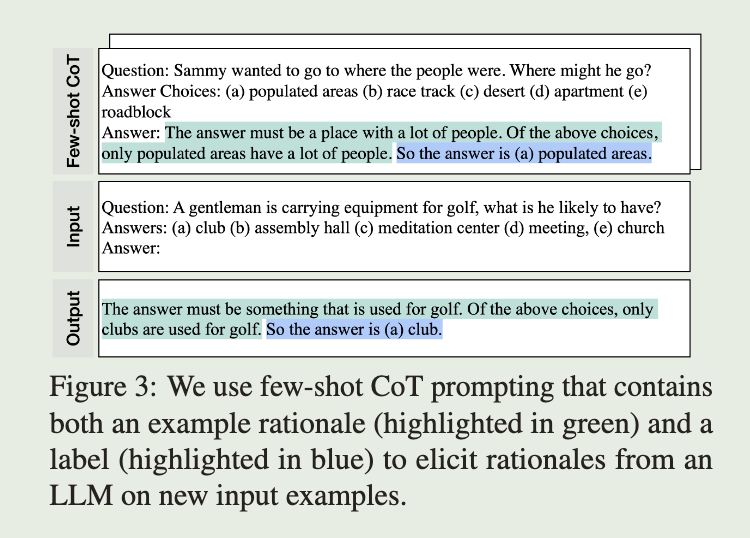
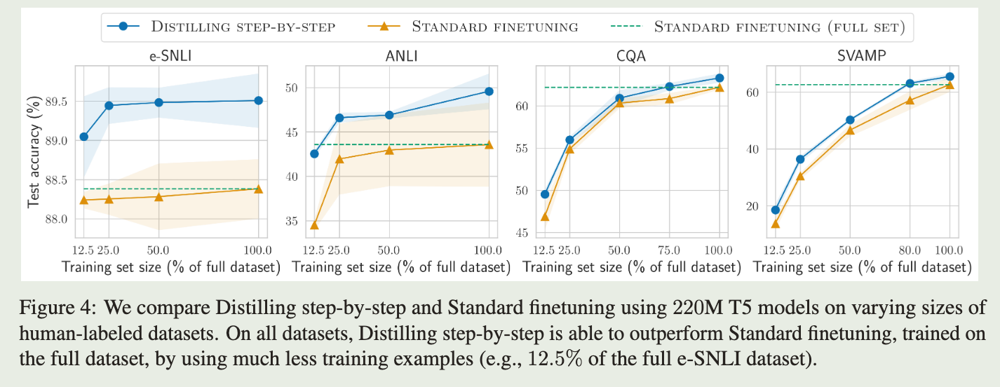
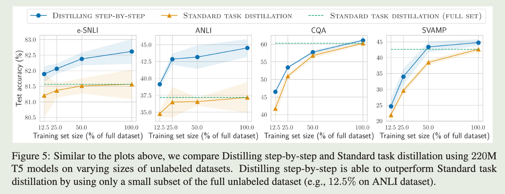
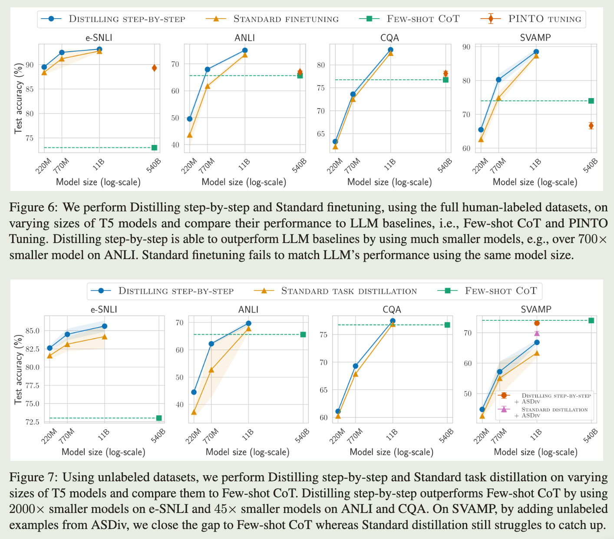
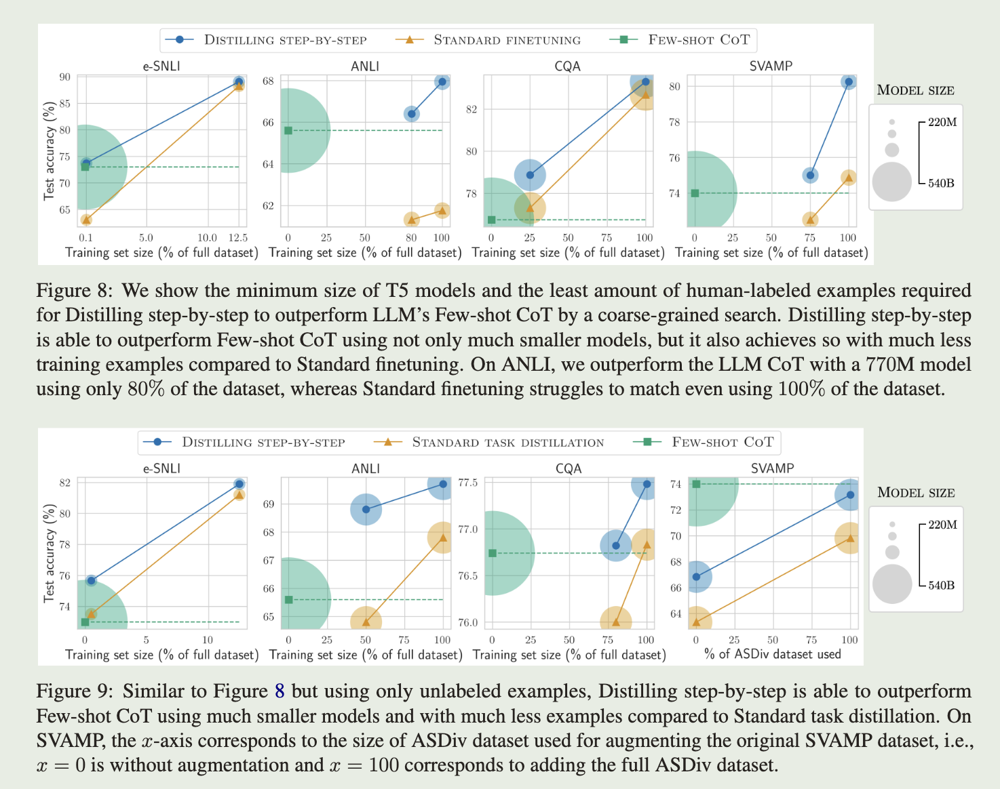

# Distilling Step-by-Step! Outperforming Larger Language Models with Less Training Data and Smaller Model Sizes

## Motivation

大模型推理需要消耗大量的计算资源，导致大模型部署困难。

小模型的部署则相对容易，但是小模型的能力有限，通常仅限于解决特定的任务，同时，特定任务上微调或蒸馏小模型需要使用大量的训练数据。

## Contribution

为了解决上述问题，本文提出了逐步蒸馏的方法，利用大模型生成的逻辑依据，并通过多任务学习的方式让小模型学习“是什么”和“为什么”，提升小模型解决特定任务的能力，同时降低对训练数据数量的要求。

1. 相较于一般的小模型微调和蒸馏，该方法可以使用较少的数据和更小的模型实现更好的表现

2. 相对于few-shot提示的大模型，小模型的表现更好

## Distilling Stey-by-Step

逐步蒸馏主要包含两个步骤：

1. 给定指令 $x$ 和回复 $y$，使用大模型生成逻辑依据 $r$，其中 $y$ 可以通过人类标注或大模型生成获取；

2. 使用数据 $X, Y, R$ 训练小模型；

### 使用大模型生成逻辑依据

给定一个指令 $x$ 和回复 $y$，使用few-shot Cot的方式生成 $x,y$的逻辑依据 $r$。如下图所示，prompt中包含一个示例 $x_p, y_p, r_p$，以及指令 $x$，大模型会生成 $r_x, y_x$.

## 使用逻辑依据训练小模型

对于一般的微调和蒸馏，其目标函数如下：

$$ L_{label} = \frac{1}{N} \sum_{i=1}^{N} l(f(x_i), y_i) $$

其中 $l$ 为交叉熵损失函数，$y$ 可以是人类标注或大模型生成的标注。

本文将大模型生成的逻辑依据作为额外的监督，通过多任务学习的方式训练小模型，目标函数如下：

$$ L = L_{label} + \lambda L_{rationale} $$

$$ L_{rationale} = \frac{1}{N} \sum_{i=1}^{N} l(f(x_i), r_i) $$

小模型可以学习获得答案的中间推理步骤，从而更好的生成答案。同时这两个任务的prompt不同，在推理时使用生成答案的prompt，也不会增加推理的开销。

## Experiments

文本使用 540B PaLM作为大模型（教师模型），T5 作为小模型（学生模型），在四个下游任务上与一般的微调和蒸馏方法、few-shot大模型进行对比。实验结果如下：

1. 逐步蒸馏比一般的微调需要更少的数据

   下图中横轴为微调使用的数据量，纵轴为下游任务的准确率。达到相同的准确率，逐步蒸馏所需的数据更少。

   

2. 逐步蒸馏比一般的蒸馏需要更少的数据
   
   下图中横轴为蒸馏使用的数据量，纵轴为下游任务的准确率。达到相同的准确率，逐步蒸馏所需的数据更少。
   
   

3. 逐步蒸馏可以降低模型的尺寸

   下两图（上图为微调，下图为蒸馏）图中横轴为学生模型的参数量，纵轴为下游任务的准确率。达到相同的准确率，逐步蒸馏所需的模型参数量更小。

   

4. 逐步蒸馏可以使用更少的数据和参数量获得优于大模型的下游表现

   下两图（上图为微调，下图为蒸馏）图中横轴为训练的样本数量，纵轴为下游任务的准确率，圆的大小表示模型的参数量大小。逐步蒸馏更容易在下游任务上超过LLM。

   