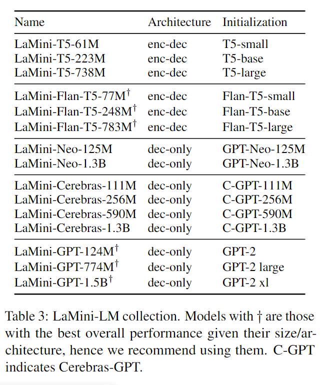

# LaMini-LM: A Diverse Herd of Distilled Models from Large-Scale Instructions

## Motivation

大语言模型展现了卓越的生成能力，但是同时需要消耗大量的计算资源和能源。为了缓解这个问题，本文通过蒸馏的方法将大语言模型的能力注入到很小的模型（61M-1.5B）中。

## Contribution

1. 贡献了一个指令微调数据，包含2.58M的样本，覆盖了丰富的主题。

2. 探索了不同结构（encoder-decoder，decoder-only）和不同大小（61M-1.5B）的模型蒸馏，并进行了大量的实验，蒸馏得到的模型可以获得和Alpaca（7B）相媲美的能力。

## Knowledge Distillation

对于生成式模型，序列级蒸馏使用教师模型推理，生成合成输出。合成输出用于训练学生模型。先前的工作已经证明了序列级蒸馏的有效性。

本文使用 GPT3.5-turbo 作为教师模型，并使用序列级蒸馏学生模型。

学生模型的大小从61M到1.5B，包含 encoder-decoder 和 decoder-only 结构，包括 T5、Flan-T5、Cereberas-GPT、GPT2、GPT-Neo，所有的学生模型信息如下：



## Dataset Generation

本文使用现有的数据，包括 self-instruct、alpaca、P3、FLAN，作为种子数据，通过示例引导和主题引导的方式生成指令，最后使用教师模型（GPT3.5-turbo）生成指令的回复。

1. 指令生成

   本文使用两种指令生成方式：示例引导和主题引导。

   - 示例引导

     实力引导使用如下的 prompt，其中包含三条从种子数据中采样的指令示例，并包含一些回复的要求。作者研究发现：GPT3.5-turbo需要2个示例才能生成理想的指令，3个可以获得更一致的回复格式。

     ```string
     <example>What are some things you can do to de-stress?</example>
     <example>How can individuals and organizations reduce unconscious bias?</example> <example>Write a program to compute the sum of integers from k to n.</example>

     Generate 20 diverse examples that are similar to the provided examples.
     You do not need to provide a response to the generated examples.
     Each example must include an instruction.
     Each generated instruction can be either an imperative sentence or a question.
     Each example must start with the label "<example>" and end with the label "</example>".
     ```

   - 主题引导

     为了生成更多样的指令，作者从维基百科收集多个常见的主题，并从中筛选出符合以下要求的主题：单词个数少于三个、包含10个以上的子类以及50+的页面。使用的 prompt 如下：

     ```string
     <example>Try coming up with a creative way to stay motivated during a workout.</example>
     <example>In your opinion, what are the qualities of an effective sports coach?</example>
     <example>Return the SSN number for the person: "Yann LeCun"</example>
     
     Generate 20 diverse examples that are similar to the provided examples with the topics "Design bureaus, Conidae, Infantry".
     You do not need to provide a response to the generated examples.
     Each example must include an instruction.
     Each generated instruction can be either an imperative sentence or a question.
     Each example must start with the label "<example>" and end with the label "</example>".
     ```

2. 回复生成

   教师模型生成回复时使用了如下的 system message：

   ```string
   You are a helpful assistant, but you must respond the provided instructions as concise as possible.
   ```

3. 数据分析