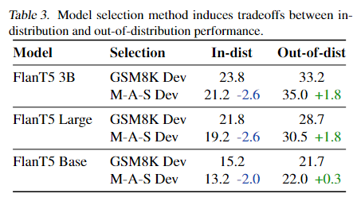

# Specializing Smaller Language Models towards Multi-Step Reasoning

## Motivation

大语言模型的in-context和chain-of-thought能力通常认为只有在模型规模达到一定规模时才会出现。小模型能否通过一定的手段，如蒸馏获得类似的能力，这个问题还没有很好的答案。

## Contribution

作者认为大模型具有大量的参数，具备强大的能力，可以在大量任务上表现优异，而小模型的容量有限，无法同时擅长多个任务，但是如果将小模型专注于解决特定任务，则可以实现更好的表现。

作者以多步数学推理任务为例，发现以下现象：

1. 语言模型多维能力之间存在非常复杂的权衡；

2. 以降低通用能力为价格，我们可以显著提升小于 10B 的模型的多步数学推理能力；

## Distillation

本文选用 code-davinci-002 作为教师模型，T5 作为学生模型，学生模型包括不同大小的预训练的T5模型和指令微调后的FlanT5，大小包括 Base (250M) / Large (760M) / XL (3B) / XXL (11B)。作者的重点是研究模型下游微调过程中的能力权衡，而不是直接对蒸馏或数据增强文献做出贡献。

### 微调数据生成

给定一个数据集，对于数据集中的某个问题，使用教师模型生成 k 个带有推理过程的回答，如果有 n 个问题，将会有 n * k 个样本。从中选取结果正确的样本作为微调数据。作者选用 gsm8k 数据集生成训练数据，gsm8k 包含 7k 的训练数据，最后生成了 130k 的蒸馏数据。

生成的数据包含以下四种格式：

1. In-context answer-only: prompt中带有示例，没有推理过程

2. In-context CoT: prompt中同时包含示例和推理过程

3. zero-shot answer-only: prompt中没有示例和推理过程

4. zero-shot CoT: prompt中没有示例，包含推理过程

此外，作者选择了 gsm8k 和 MultiArith、ASDiv、SVAMP 作为验证集，分别测试模型的分布内和分布外的数学推理能力。同时，使用 BigBench 测试模型的其他能力。

### 蒸馏方式

对于蒸馏，存在两种训练方式：

1. 样本匹配：直接在教师模型生成的数据上优化学生模型的输出

2. 分布匹配：最小化教师模型输出分布和学生模型输出分布之间的KL散度

通常第二种训练方式可以更快的收敛并且表现更佳。

### 实验结果

大体的实验结果如下：蒸馏后模型在分布内和分布外的数学推理任务上有普遍的提升，其中3B的模型的效果甚至可以超过其他6B、11B的模型，在数学之外的任务上，能力则是普遍下降。

对比蒸馏预训练模型T5和指令微调模型FlanT5，结果显示指令微调的模型蒸馏后的数学推理能力更强。同时，模型越大，蒸馏后的数学推理能力也越强。

对于分布内和分布外的数学推理任务，这两个任务模型是无法同时达到最优，在分布内数据（gsm8k）和分布外数据（MultiArith、ASDiv、SVAMP）上的最优模型不是同一个，如下表所示。

对于数学推理之外的能力，BBH上的问答能力，在模型训练初期就迅速下降，如下图子图A1所示。而子图B对比了两种蒸馏训练方式，分布匹配的效果要优于样本匹配。

最后，作者对比了不同数据格式对数学推理任务下zero-shot和few-shot能力的影响。如下图所示，训练使用few-shot训练，模型可以同时兼顾zero-shot和few-shot推理。而使用zero-shot训练，模型则只表现出zero-shot的能力，却没有few-shot的能力。

