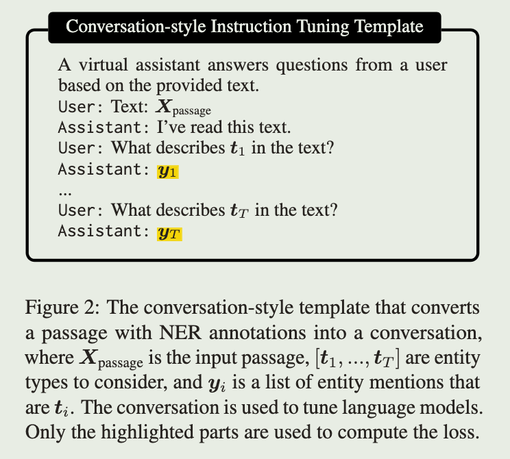
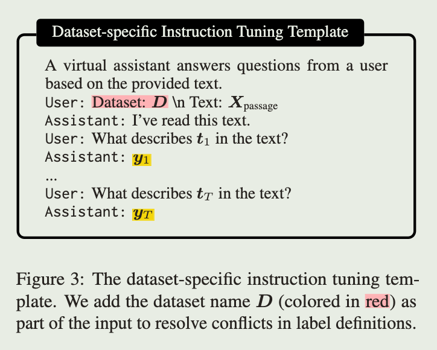
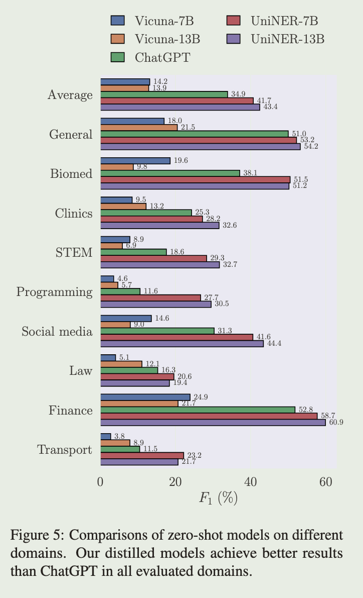

# UniversalNER: Targeted Distillation from Large Language Models for Open Named Entity Recognition

## Motivation

指令微调是可以有效的将大模型的知识蒸馏到小模型，以此产生的优异的小模型包括Alpaca和Vicuna等。但是这些模型虽然有效地模仿了大模型，但是在一些特定任务，如命名实体识别，仍与大模型具有较大差距，如命名实体识别中，Vicuna与ChatGPT的F1指标差距有20个点。

## Contribution

针对特定的下游任务，命名实体识别，本文提出一种更有针对性的蒸馏方法和 UniversalNER 模型，该模型在开放命名实体识别任务上优于Alpaca、Vicuna和ChatGPT。

此外，本文还贡献了一个命名实体识别的评测大数据，它由43个数据集组成，覆盖药物、编程、法律等9个领域。

## Mission-Focused Instruction Tuning

针对命名实体识别任务，模型的任务是在给定的文本片段 $x$ 和实体类别 $t$，返回 $x$ 中该实体类别的实体（词）。

1. 数据生成

   作者首先将 Pile 语料库中的所有文章切分成长度不超过256的文本片段，然后对于每一个文本片段，使用ChatGPT和如下的提示词生成命名实体和实体类别。

   ```string
   System Message: You are a helpful information extraction system.
   Prompt: Given a passage, your task is to extract all entities and identify their entity types. The output should be in a list of tuples of the following format:
   [("entity1", "type of entity1"), ...].

   Passage: {input_passage}
   ```

   最后总共生成了45889个样本，包含240725个命名实体和13020个实体类别。

2. 指令微调

   将上一步生成的数据转换成如下的对话风格的指令数据。其中每一轮对话只询问一种实体类别（作者对比了一次询问所有实体类别，效果没有前者好）。

   

   - 负采样

     对于开放命名实体识别，有时可能会遇到文本中没有出现的实体类别，此时模型生成的 $y_i$ 应当为空。因此作者从所有的命名实体类别中随机采样了负实体类别（$x$ 中没有出现的实体类别，采样概率正比于实体类别本身的频率，作者验证了该采样方法由于没有负样本采样和均匀负样本采样）加入上图的数据中，其对应的 $y_i$ 为空。

   - 监督数据

     当有额外的人类标注数据时，可以进一步提升模型的表现。然而多个数据集中可能存在标签上的冲突，如相同的实体类别在不同数据集中的标签名称不一样。为了解决上述问题，作者在人类标注数据中加入了数据集本身的相关信息，如下所示。

     

## Experiments

   作者基于LLaMA模型微调了UniversalNER，并于ChatGPT、Vicuna、InstructUIE（在各种信息提取数据集上监督微调的模型）进行了对比。

   评测数据使用了9大类的43个命名实体识别数据集。评测结果如下，7b、13b的UniversalNER不仅优于Vicuna，还要优于ChatGPT。

   
