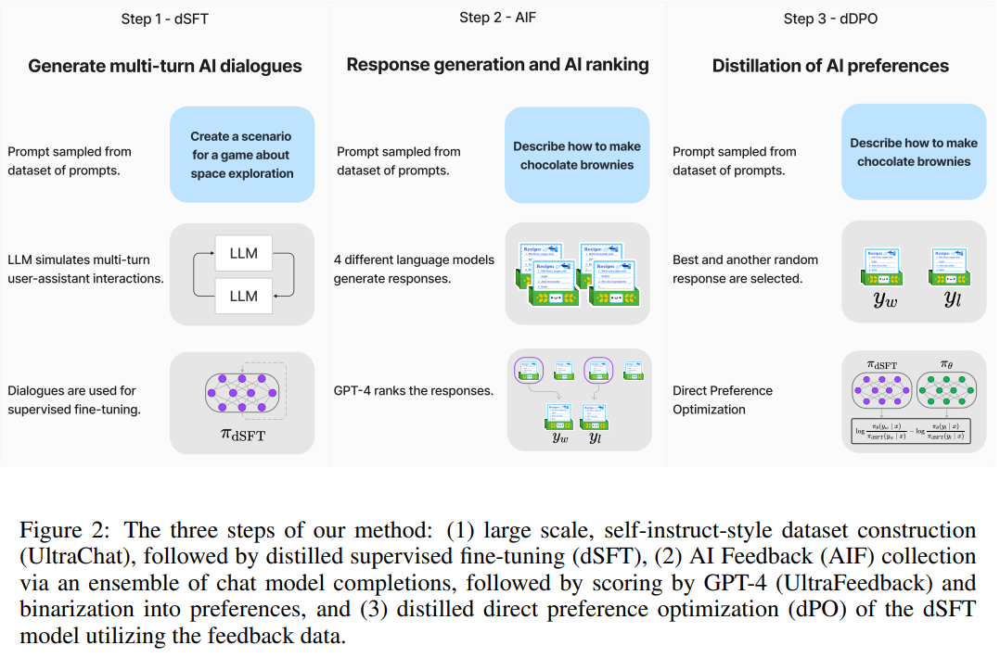

# Zephyr: Direct Distillation of LM Alignment

## Motivation

蒸馏是提升模型在下游任务表现的有效方法。蒸馏监督微调（dSFT）可以提升下游任务的准确率，但是用户发现微调的模型存在与人类意图不一致的问题，导致模型无法正确回答自然的提示词。

而PPO等强化学习对齐人类意图的方法，需要大量的人类标注和采样。

## Contribution

提出了一种基于蒸馏的方法解决对齐问题。主要步骤包括：

1. 使用大规模、self-instruct数据集进行dSFT训练。

2. 使用GPT4打分构建AI Feedback (AIF) 数据。

3. 使用AIF数据，dDPO (distilled direct preference optimization)微调dSFT模型。

微调的模型在MT-Bench和AlpacaEval上均表现良好：优于开源7b模型，和LLAMA2 70b模型相媲美。

## Method

假设当前拥有一个教师模型 $\pi_T$，目标是获得一个学生模型 $\pi_S$，提出的蒸馏方法步骤如图所示：

1. Distilled Supervised Fine-Tuning (dSFT)

   参考Alpaca或self-instruct方法使用 $\pi_T$ 生成微调数据，通过SFT的方式将 $\pi_T$ 的知识蒸馏给 $\pi_S$，获得模型 $\pi_{dSFT}$。

2. AI Feedback through Preferences (AIF)

   人类反馈可以提供额外的信息，这些信息可用于对齐模型和人类偏好。本方法使用AI反馈代替人类反馈，生成AIF数据。具体方法如下：

   使用4个不同的大模型（如Claude、Falcon、LLAMA等）对同一个提示词 $x$ 生成回答，然后使用GPT4对这个四个回答进行打分，最高分的回答作为正样本 $y_w$，其余三个作为负样本 $y_l$。AIF数据的每个样本都是如下的三元组 $(x, y_w, y_l)$.

3. Distilled Direct Preference Optimization (dDPO)

   